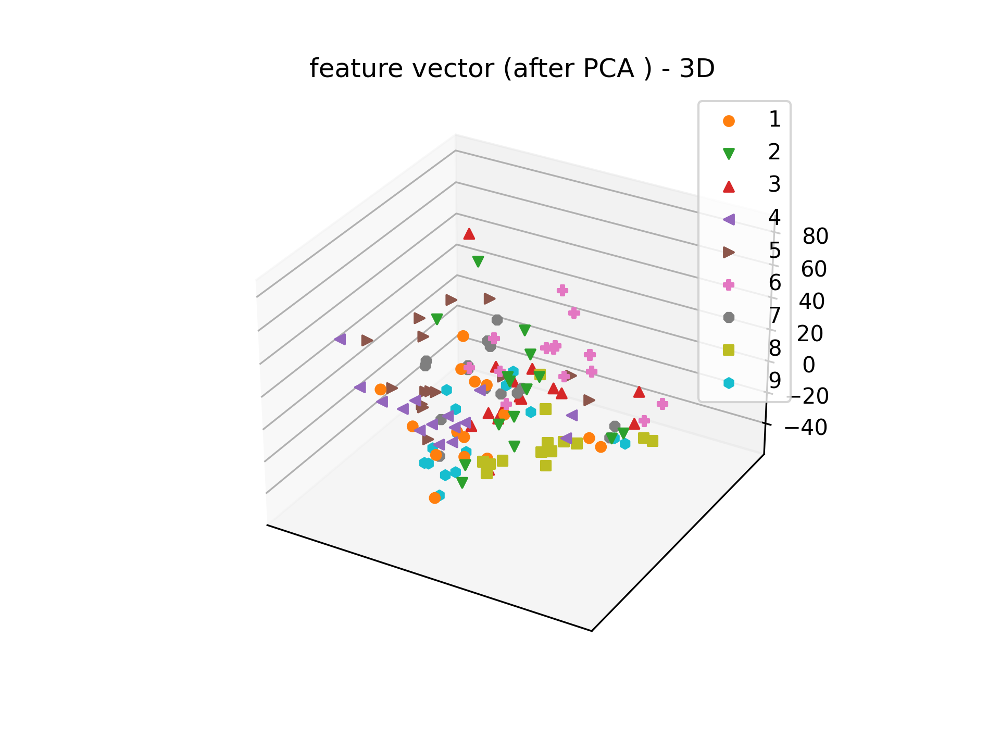
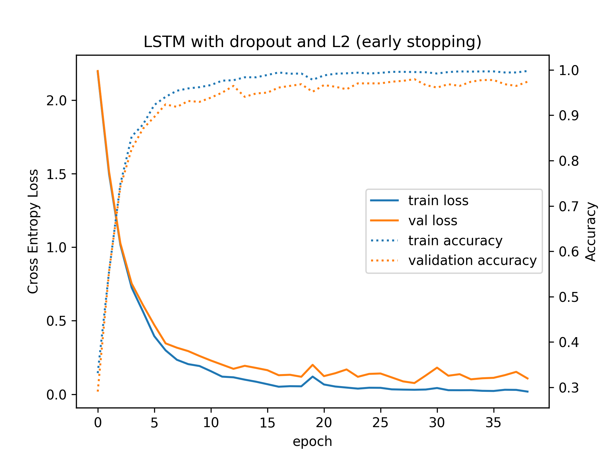

\newpage

## Οδηγίες για το πως να εκτελεστεί ο κώδικας

\textcolor{red}{ Οδηγίες για το πως να εκτελεστεί ο κώδικας δίνονται στο README.md αρχείο το οποίο υποβάλαμε. }

## Βήμα 1

Σε αυτό το βήμα αναλύσαμε τις προτάσεις "one two three" των ομιλητών 1 και 8.
Παρακάτω φαίνονται οι κυματομορφές και τα spectrograms των δύο ομιλητών.

{width=70%}

{width=70%}

Από τις κυματομορφές και τα spectrograms δεν μπορούμε να βγάλουμε πολλά
συμπεράσματα. Παρατηρούμε όμως ότι οι κυματομορφές των δύο ομιλητών
έχουν πολύ παρόμοιες περιβάλλουσες. Επίσης στα spectrograms παρατηρούμε
πως υπάρχουν μαύρες λωρίδες που εκτείνονται κατά μήκος του άξονα του χρόνου.
Αυτές οι λωρίδες αντιστοιχούν στα formants. Σημειώνουμε ότι στα spectrograms
το μαύρο χρώμα αντιστοιχεί σε μεγάλο πλάτος ενώ το άσπρο σε μικρό.

Παρακάτω φαίνεται ένας πίνακας με το μέσο **pitch** σε $Hz$ κάθε φωνήματος για κάθε
λέξη για τον **ομιλητή 1**.

| Speaker 1 | "α"   | "ου"  | "ι"   |
| :---:     | :---: | :---: | :---: |
| one       | 134.6 | 133.8 |  -    |
| two       |  -    | 131.6 |  -    |
| three     |  -    |  -    | 132.4 |

Παρακάτω φαίνεται ο ίδιος πίνακας για το **pitch του ομιλητή 8**:

| Speaker 8 | "α"   | "ου"  | "ι"   |
| :---:     | :---: | :---: | :---: |
| one       | 176.8 | 184.1 |  -    |
| two       |  -    | 188.9 |  -    |
| three     |  -    |  -    | 179.5 |

Παρακάτω φαίνεται o πίνακας με τα τρίτα πρώτα **formats του ομιλητή 1** σε $Hz$:

| Speaker 1  | Formant 1   | Formant 2  | Formant 3   |
| :---:      | :---:       | :---:      | :---:       |
| "α"        | 762.9       | 1167.0     | 2407.3      |
| "ου" (one) | 561.0       | 982.5      | 2358.7      |
| "ου" (two) | 379.7       | 1766.7     | 2419.2      |
| "ι"        | 417.1       | 1995.0     | 2466.2      |

Στο παραπάνω πίνακα έχουμε σημειώσει με "ου" (one) το φώνημα "ου" της
λέξης one. Κατά αντιστοιχία συμβολίζουμε με "ου" (two) το φώνημα "ου"
της λέξης two.

Παρακάτω φαίνεται ο ίδιος πίνακας για τον **ομιλητή 8**:

| Speaker 8  | Formant 1   | Formant 2  | Formant 3   |
| :---:      | :---:       | :---:      | :---:       |
| "α"        | 871.2       | 1774.6     | 3132.6      |
| "ου" (one) | 554.8       | 1003.4     | 2518.6      |
| "ου" (two) | 365.5       | 1718.2     | 2683.3      |
| "ι"        | 435.3       | 2189.6     | 2949.0      |

Από τους πίνακες για το μέσο pitch κάθε φωνήματος των ομιλητών
παρατηρούμε πως το pitch του ομιλητή 8 είναι μεγαλύτερο από τις
αντίστοιχες τιμές για το pitch του ομιλητή 1. Η αύξηση στο pitch
είναι περίπου 40 με 50 Ηz. Αυτό είναι λογικό αφού ο ομιλητής 1
είναι άντρας ενώ ο ομιλητής 8 είναι γυναίκα.

Όσο αφορά τα formants παρατηρούμε πως είναι κάπως πιο παρόμοια
μεταξύ των ομιλητών. Για παράδειγμα τα πρώτα formants για κάθε
φώνημα είναι περίπου τα ίδια με μικρές διαφοροποιήσεις. Μεγαλύτερη
διαφορά παρατηρούμε στο δεύτερο formants του φωνήματος "α"
ενώ τα υπόλοιπα δεύτερα formants είναι περίπου τα ίδια, με τα formants
του ομιλητή 8 να βρίσκονται σε ελάχιστα μεγαλύτερη συχνότητα. Ακόμη
μεγαλύτερη διαφορά παρατηρούμε στο τρίτο formant των φωνημάτων με
την μεγαλύτερη αύξηση να παρατηρείτε και πάλι στο φώνημα "α".

Συνοψίζοντας στον ομιλητή 8 που είναι γυναίκα
παρατηρείτε μεγαλύτερο pitch από τον ομιλητή 1 που είναι άντρας.
Όσο αφορά τα formants, τα πρώτα formants είναι πρακτικά τα ίδια
και για τους δύο ομιλητές με τις διαφοροποιήσεις να εμφανίζονται
σταδιακά πιο έντονα για τα μεγαλύτερης τάξης formants. Η διαφοροποίηση
στα formants είναι η αυξημένη συχνότητα αυτών στον ομιλητή 8 που είναι
γυναίκα.


## Βήμα 2

Για το βήμα αυτό προσαρμόσαμε τον βοηθητικό κώδικα ώστε να δουλεύει
στην περίπτωση μας. (Ο βοηθητικός κώδικας περίμενε άλλη σύμβαση στην
ονομασία των αρχείων.) Επίσης στην δικιά μας αποποίηση "μεταφράζουμε"
τα labels, που είναι το ψηφίο, από κείμενο σε int. Για παράδειγμα
μετατρέπουμε το "eight" σε 8. Τέλος επιστρέφουμε και το sampling
rate. Η συνάρτηση αυτή βρίσκεται στο αρχείο `lib.py` και φαίνεται
παρακάτω:

```{.python}
def data_parser(directory="dataset/digits"):
    """
    Reads all the wav files and returns 3 lists and the sampling rate.
    The first list containts the audio from the wav files.
    The second list contains the id of the speaker.
    The third list contains which digit was told.
    """

    files = glob(os.path.join(directory, "*.wav"))
    
    # get only the filenames without the path and the .wav
     
    fnames = [os.path.basename(path) for path in files]
    fnames = [f.split(".")[0] for f in fnames]

    # get the sampling rate of the audio
    _, sampling_rate = librosa.core.load(files[0], sr=None)

    def read_wav(f):
        wav, _ = librosa.core.load(f, sr=None)
        return wav

    def parse_digit_labels(text):
        LUT = {
            "one":      1,
            "two":      2,
            "three":    3,
            "four":     4,
            "five":     5,
            "six":      6,
            "seven":    7,
            "eight":    8,
            "nine":     9
        }

        return LUT[text]


    # a regular expression
    # it is used to extract the 
    # digit and the speaker id
    regex = re.compile("([a-z]*)([0-9]*)")

    # the three lists to return
    wavs = [read_wav(f) for f in files]
    speaker_ids = [regex.search(f).group(2) for f in fnames]
    digits = [regex.search(f).group(1) for f in fnames]

    # parse text to integers
    digits = [parse_digit_labels(x) for x in digits]

    return wavs, speaker_ids, digits, sampling_rate
```

## Βήμα 3

<!-- TODO: λέει πιο κάτω αν δεν κάνω λάθος να τα κάνουμε concat
στο βήμα 5 αλλά μάλλον δεν υπάρχει θέμα -->

Στο ερώτημα αυτό εξάγουμε τα mfccs για κάθε utterance. Επίσης
εξάγουμε και τα delta και delta-delta χαρακτηριστικά και τα κάνουμε
concat με τα mfccs. Η συνάρτηση που κάνει αυτήν την δουλεία βρίσκεται στο `lib.py`
και ονομάζεται `extract_features`. Δεν θέλουμε να κάνουμε κάποια
παρατήρηση τον κώδικα που γράψαμε αλλά τον παραθέτουμε για λόγους
ευκολίας:

```{.python}
def extract_features(wavs, n_mfcc, Fs):
    # Extract MFCCs for all wavs
    window = 25 * Fs // 1000 # 25 msec
    step = 10 * Fs // 1000 # 10 msec

    def all_features(wav):
        mfcc = librosa.feature.mfcc(
                y=wav,
                sr=Fs,
                n_fft=window,
                hop_length=step,
                n_mfcc=n_mfcc
            )

        mfcc_delta =  librosa.feature.delta(mfcc)
        mfcc_delta_delta =  librosa.feature.delta(mfcc, order=2)

        # concatenate all the features together
        # the final shape is (#frames, n_mfcc * 3)
        result = np.concatenate((mfcc.T, mfcc_delta.T, mfcc_delta_delta.T), axis=1)

        return result
            

    features = [
        all_features(wav)
        for wav in tqdm(wavs, desc="Extracting mfcc features...")
    ]

    print("Feature extraction completed with {} mfccs per frame and delta and delta-delta".format(n_mfcc))

    return features
```

## Βήμα 4

Αρχικά για το βήμα αυτό φτιάξαμε τα ιστογράμματα του πρώτου και δεύτερου
mfcc για τα ψηφία `n1=6` και `n2=2`. Για τα παρακάτω ιστογράμματα
χρησιμοποιήσαμε κάθε utterance για το συγκεκριμένο ψηφίο αλλά και όλα
τους τα χρονικά παράθυρα. Τα ιστογράμματα φαίνονται παρακάτω:

{width=80%}

{width=80%}

<!-- TODO: νομίζω αυτό εννοεί με απόκλιση -->
Από τα ιστογράμματα αυτά βλέπουμε ότι το πρώτο mffc για τα ψηφία
6 και 2 έχουν περίπου την ίδια κατανομή. Συνεπώς, έχοντας μόνο
αυτό μέχρι στιγμής κατά νου υποθέτουμε ότι το πρώτο χαρακτηριστικό
δεν θα βοηθήσει ιδιαίτερα για τον διαχωρισμό αυτών των δύο ψηφίων.
Αυτό όμως ισχύει στην περίπτωση που το μοντέλο δεν παίρνει υπόψη
την εξέλιξη του πρώτου mfcc στον χρόνο από τα διαφορετικά παράθυρα.

Όσο αφορά το δεύτερο mfcc παρατηρούμε ότι και πάλι τα ιστογράμματα
μοιάζουν, αλλά διαφέρουν σε αρκετά σημεία. Για παράδειγμα και στα
δύο έχουμε το μεγαλύτερο peak στο ιστόγραμμα για την τιμή 100.
Από την άλλη όμως για το ψηφίο 6 έχουμε ένα peak στο 30 (περίπου)
το οποίο δεν υπάρχει στο ιστόγραμμα του ψηφίου 2. Συνεπώς υποθέτουμε
ότι το δεύτερο mfcc μπορεί να παίξει πιο σημαντικό ρόλο στον διαχωρισμό
των ψηφίων 6 και 2 από ότι το πρώτο mfcc. Αυτό πάλι ισχύει εφόσον
το μοντέλο δεν παίρνει υπόψη του την χρονική εξέλιξη των mfccs.

Στην συνέχεια εξάγουμε τα MFSCs για κάθε utterance. Η συνάρτηση που κάνει αυτήν την δουλεία βρίσκεται στο `lib.py`
και ονομάζεται `extract_mfsc`. Δεν θέλουμε να κάνουμε κάποια
παρατήρηση τον κώδικα που γράψαμε αλλά τον παραθέτουμε για λόγους
ευκολίας:

```{.python}
def extract_mfsc(wavs, n_mfsc=6, Fs=8000):
    # Extract MFCCs for all wavs
    window = 30 * Fs // 1000
    step = window // 2
    frames = [
        librosa.feature.melspectrogram(
            y=wav, sr=Fs, n_fft=window, hop_length=window - step, n_mels=n_mfsc
        ).T

        for wav in tqdm(wavs, desc="Extracting mfsc features...")
    ]

    print("Feature extraction completed with {} mfscs per frame".format(n_mfsc))

    return frames
```

Για δύο εκφωνήσεις του καθενός από τα ψηφία `n1=6` και `n2=2` υπολογίζουμε την συσχέτιση των MFSCs και στην έπειτα την συσχέτιση των MFCCs χρησιμοποιώντας την έτοιμη συνάρτηση `corr()`. Η γραφική αναπαράσταση της συσχέτισης για την κάθε εκφώνηση φαίνεται παρακάτω:

{width=80%}

{width=80%}

Παρατηρούμε ότι τα MFCCs είναι αισθητά λιγότερο συσχετισμένα συγκριτικά με τα MFSCs, δηλαδή η εφαρμογή του μετασχηματισμού DCT αφού εφαρμοστεί η συστοιχία φίλτρων της κλίμακας Mel
πάνω στο φάσμα του σήματος φωνής μειώνει την συσχέτιση μεταξύ των εξαγόμενων χαρακτηριστικών. Το προηγούμενο το καταλαβαίνουμε γιατί στον πίνακα
συσχέτισης των MFCC μεγάλες τιμές παίρνει μόνο η κύρια διαγώνιος ενώ στα MFSCs έχουμε μεγάλες τιμές και εκτός διαγωνίου. Αυτός είναι και ο λόγος που είναι περισσότερα υποσχόμενη η χρήση των MFCCs αντί των MFSCs σε τέτοιου είδους προβλήματα αναγνώρισης φωνής.

## Βήμα 5

Σε αυτό το βήμα έχοντας ήδη ενώσει τα mfccs, deltas και delta-deltas σε πίνακα (#utterance x #frames x (13 * 3)) υπολογίζουμε για κάθε utterance την μέση τιμή και την τυπική απόκλιση κάθε χαρακτηριστικού για όλα τα παράθυρα της εκφώνησης αυτής υπολογίζοντας την μέση τιμή και την απόκλιση της κάθε γραμμής του #frames x (13 * 3) πίνακα που αντιστοιχεί στην εκφώνηση. Μας ενδιαφέρουν οι 2 πρώτες διαστάσεις των διανυσμάτων αυτών, δηλαδή οι μέσες τιμές για όλα τα frames του 1ου και του 2ου MFCC κάθε utterance. Η αναπαράσταση των 2 πρώτων διαστάσεων των διανυσμάτων αυτών γίνεται με την βοήθεια της συνάρτησης `scatter()` και το διάγραμμα που προκύπτει φαίνεται παρακάτω:

{width=80%}

Παρατηρούμε ότι υπάρχουν αρκετά δείγματα (εκφωνήσεις) κλάσεων που μοιράζονται την ίδια περιοχή στον χώρο των δεδομένων που σημαίνει ότι τα δείγματα αυτά εμφανίζουν ομοιότητες στις τιμές των χαρακτηριστικών παρόλου που ανήκουν σε διαφορετικές κλάσεις. Αυτό θα ήταν ένα σημαντικό εμπόδιο στο πρόβλημα της ταξινόμησης. Είναι εμφανές ότι με βάση μόνο αυτά δεν περιμένουμε ένας ταξινομητής να είναι σε θέση να κατηγοριοποιήσει με ικανοποιητικό accuracy τις εκφωνήσεις στα ψηφία που αφορούν, δηλαδή τα δύο αυτά χαρακτηριστικά δεν είναι περιέχουν αρκετή πληροφορία για να διαχωρίσουν τις εκφωνήσεις διαφορετικών ψηφίων. Είναι απαραίτητο να χρησιμοποιήσουμε και τα υπόλοιπα χαρακτηριστικά του feature vector.


## Βήμα 6

Στο βήμα αυτό υπολογίζουμε 2 πρώτα principal components των 13*3*2-διάστατων feature vectors χρησιμοποιώντας την κλάση `PCA` της `sklearn` και φτιάχνουμε ένα scatter plot των διανυσμάτων που συνίσταται από τα 2 PC αυτά. Σε σχέση με το scatter plot του προηγούμενου ερωτήματος παρατηρούμε ότι οι κλάσεις συνεχίζουν να μην είναι ευδιάκριτα διαχωρισμένες. Η εικόνα όσον αφορά την επικάλυψη κλάσεων δεν φαίνεται να διαφοροποιείται ιδιαίτερα από εκείνη που είχαμε στο προηγούμενο βήμα κρατώντας τις δύο πρώτες διαστάσεις του feature vector. 

Στην συνέχεια υπολογίζουμε τα 3 πρώτα PC και τα χρησιμοποιούμε αντίστοιχα για να κατασκευάσουμε ένα 3D scatter plot. Παρατηρούμε ότι τα δείγματα που ανήκουν στην ίδια κλάση φαίνεται να έχουν αρχίσει να δημιουργούν συστάδες (clusters) και πάλι όμως ο διαχωρισμός τους δεν είναι εμφανής. Χρησιμοποιώντας το attribute της κλάσης PCA `explained_variance_ratio_` παίρνουμε το ποσοστό της αρχικής διασποράς διατηρούν οι συνιστώσεις που προέκυψαν. Στην έξοδο του προγράμματος βλέπουμε:

```{.html}
Variance Ratio (preserved) after PCA (# components = 2): 70.65 %
Variance Ratio (preserved) after PCA (# components = 3): 81.49 %
Variance Ratio (preserved) by each of the first 3 PC : [0.58794457 0.11858345 0.10839222]       
```

Επομένως, οι 2 πρώτες PC εξηγούν το 70.65% της διασποράς των δεδομένων ενώ οι 3 πρώτες το 81.49%. Η προσθήκη μίας επιπλέον PC εξηγεί μόνο 10% επιπλέον της διασποράς και οι υπόλοιπες PC εξηγούν μόνο του 20% περίπου της διασποράς. Επομένως, καταφέρνουμε με 3 μόνο κύριες συνιστώσες να κρατήσουμε αρκετή από την αρχική πληροφορία του διανύσματος χαρακτηριστικών οπότε περιμένουμε η ταξινόμηση με την χρήση αυτών να έχει ικανοποιητικά αποτελέσματα. Δεδομένου ότι το feature vector είναι 39*2 διαστάσεων είναι αναμενόμενο ότι κρατώντας μόνο 2 ή ακόμα και 3 PC η ταξινόμηση θα έχει μικρότερο accuracy όμως εκτιμούμε ότι είναι ένα καλό trade-off[^trade_off].

[^trade_off]:  Το trade-off που έχουμε είναι μεταξύ της χρονικής διάρκειας της εκπαίδευσης του μοντέλου και του accuracy που πετυχαίνει.


{width=70%}

{width=80%}

## Βήμα 7

Στο βήμα αυτό χωρίσουμε το dataset σε train και test set με αναλογία 70% - 30% χρησιμοιώντας την συνάρτηση `train_test_split` της sklearn. Δοκιμάζουμε τον Custom Naive Bayes (υλοποιούμε την κλάση `CustomNBClassifier` που είναι προσαρμογή της υλοποίησής της στην 1η εργαστηριακή άσκηση στο νέο dataset), τον Naive Bayes της sklearn, τον SVM (linear, rbf και poly kernel), τον KNN και τον Logistic Regression. Για κάθε έναν από αυτούς τους ταξινομητές κάνουμε αρχικά fit στο train set και στην συνέχεια μετράμε την απόδοσή του υπολογίζοντας το accuracy που πετυχαίνει στο test set ως μετρική. Στην έξοδο του προγράμματος παίρνουμε:

```{.html}
Accuracy Score for SVM (linear): 72.5 %
Accuracy Score for LR: 65.0 %
Accuracy Score for NB: 60.0 %
Accuracy Score for CustomNB: 60.0 %
Accuracy Score for SVM (rbf): 55.0 %
Accuracy Score for 1-NN: 55.0 %
Accuracy Score for 5-NN: 37.5 %
Accuracy Score for 15-NN: 35.0 %
Accuracy Score for 50-NN: 25.0 %
Accuracy Score for SVM (poly): 20.0 %
```

Παρατηρούμε ότι ο SVM με linear kernel πετυχαίνει το υψηλότερο accuracy = 72.5%. Ακολουθεί ο LR που πετυχαίνει accuracy 65%. Η καλή επίδοση των ταξινομητών αυτών μάλλον οφείλεται στο ότι τα δεδομένα του προβλήματος είναι γραμμικά διαχωρίσιμα. Παρατηρούμε ότι ο NB (ίδια επίδοση και η έτοιμη υλοποίηση της sklearn και η δική μας) έχει λιγότερο ικανοποιητικά αποτελέσματα πετυχαίνοντας 60% accuracy. Αυτό πιθανότατα οφείλεται στην θεώρησή του ότι τα χαρακτηριστικά είναι ανεξάρτητα[^why_not_indepedent]. Ακόμα χειρότερη επίδοση φαίνεται να έχει ο K-NN. Δοκιμάστηκαν τιμές Κ = 1, 5, 15, και 50. Αυξάνοντας την τιμή του K το accuracy πέφτει που σημαίνει ότι οι κλάσεις είναι κοντά μεταξύ τους και έτσι το "smoothing" των ορίων διαχωρισμού οδηγεί σε mispredictions. 

[^why_not_indepedent]: Στο βήμα 4 δείξαμε ότι τα mfcc είναι ασυσχέτιστα μεταξύ
τους (και συνεπώς ανεξάρτητα αν κάνουμε την υπόθεση ότι ακολουθούν κανονικές
κατανομές). Όμως εδώ χρησιμοποιούμε ως features τις μέσες τιμές και τις διασπορές
αυτών των οποίων οι τιμές είναι εξαρτημένες. Για παράδειγμα 2 ανεξάρτητα ζάρια
έχουν πάντα την ίδια μέση τιμή.

Στην συνέχεια προσθέτουμε τον μέσο όρο του zero crossing rate των frames κάθε utterance ως ένα επιπλέον feature σε κάθε δείγμα (utterance) του dataset μας χρησιμοποιώντας την συνάρτηση `zero_crossing_rate` της `librosa`. Χωρίζουμε ξανά σε train και test set το νέο dataset στο οποίο στα features του κάθε δείγματος έχουμε προσθέσει και το zero crossing rate. Μετά την εκπαίδευση στην έξοδο του προγράμματος έχουμε:

```{.html}
Accuracies after adding zero crossings to feature vector:
Accuracy Score for SVM (linear): 77.5 %
Accuracy Score for LR: 67.5 %
Accuracy Score for NB: 65.0 %
Accuracy Score for CustomNB: 65.0 %
Accuracy Score for SVM (rbf): 55.0 %
Accuracy Score for 1-NN: 55.0 %
Accuracy Score for 5-NN: 40.0 %
Accuracy Score for 15-NN: 30.0 %
Accuracy Score for 50-NN: 27.5 %
Accuracy Score for SVM (poly): 22.5 %
```

Παρατηρούμε ότι το accuracy των περισσότερων ταξινομητών αυξάνεται με τον SVM (linear kernel) να σημειώνει την μεγαλύτερη αύξηση (+5%). Κάποια ψηφία διαφοροποιούνται σημαντικά όσον αφορά την τιμή του zero crossing rate (π.χ.  "one", "nine" έχουν μικρότερο zero crossing rate από τα "six", "five"). Αποτελεί λοιπόν ένα χαρακτηριστικό που μπορεί να διαχωρίσει εκφωνήσεις κάποιων ψηφίων μεταξύ τους (εκείνων με υψηλή τιμή zero crossing rate από εκείνα με συγκριτικά χαμηλότερη) βοηθώντας τους περισσότερους ταξινομητές να μειώσουν τα mipredictions που μπερδεύουν εκφωνήσεις που διαφοροποιούνται στην τιμή του zero crossing rate. 


## Βήμα 8

Για το βήμα αυτό αρχικά πρέπει να δημιουργήσουμε ζεύγη 10 σημείων
ημίτονου με 10 σημεία συνημίτονου, ώστε να μπορέσουμε να εκπαιδεύσουν
το μοντέλο. Τελικά εμείς παράγαμε 200 τέτοια ζεύγη, τα οποία διαφέρουν
μεταξύ τους γιατί έχουν διαφορετική αρχική φάση. Για να έχουν
διαφορετική αρχική φάση, απλά επιλέγουμε από μία ομοιόμορφη κατανομή
τον "αρχικό χρόνο" από το διάστημα $[0, 1/40 sec]$. Επίσης επιλέξαμε
να δειγματοληπτούμε τα περιοδικά αυτά σήματα με συχνότητα $320Hz$. Αυτή
η συχνότητα δειγματοληψίας αντιστοιχεί σε 8 δείγματα ανά περίοδο, οπότε
η ακολουθία των 10 σημείων θα περιέχει μία πλήρη περίοδο και λίγο ακόμη.

Παρακάτω δείχνουμε την συνάρτηση που παράγει τα ζεύγη αυτά:

```{.python}
def gen_data_step_8(N=200):
    """
    This function generates sequences of 10 samples
    from the sin and cos funtion (f=40Hz). It generates
    lots of these sequences in order to train a recursive model. 

    Args:
        N : the number of sin and cos pairs/sequences to generate
    Returns:
        list of sin and cos sequences
    """

    # 320Hz sampling rate
    # corresponds to 8 samples per period
    Fs = 320
    Ts = 1/ Fs

    # frequency and period of functions
    freq = 40
    T = 1/ freq

    # the number of sample to take from the
    # sin and the cos for each training sequence
    samples_per_sequence = 10

    # The two lists that will hold all the
    # training examples-sequences.
    # x will hold the sin sequences.
    # y will hold the cos sequences.
    x = []
    y = []

    for _ in range(N):

        # pick a random stating time
        start_time = random.uniform(0, T)

        # get the moments in time where we are going to
        # calculate the sin and cos function value
        t = start_time + Ts * np.arange(samples_per_sequence)

        # get the sin and cos sequence
        x_samples = np.sin( 2 * np.pi * freq * t)
        y_samples = np.cos( 2 * np.pi * freq * t)

        # append them to the list
        x.append(x_samples)
        y.append(y_samples)

    # return the training samples that are generated
    return np.array(x), np.array(y)
```

Παρακάτω παρουσιάζουμε 4 δείγματα από τα 200 που παράγαμε:


Όσο αφορά το μοντέλο φτιάξαμε μία κλάση την οποία ονομάσαμε `RecursiveCosPredictor`.
Σε αυτήν φτιάχνουμε ένα αναδρομικό layer το οποίο είναι RNN, LSTM ή GRU.
Η επιλογή του αναδρομικού layer γίνεται από την παράμετρο `recursive_layer`
η οποία παίρνει τις τιμές string "RNN", "LSTM" ή "GRU". Επίσης μέρα από
το αναδρομικό layer έχουμε και ένα fully connected layer χωρίς κάποιο
μη γραμμικό activation function, που παίρνει στην είσοδο του τα hidden
state από το αναδρομικό layer και στην έξοδο του βγάζει την πρόβλεψη για
το cos. Παρακάτω φαίνεται σε σχέδιο η αρχιτεκτονική του μοντέλου για τα
διάφορα αναδρομικά layers:

{width=80%}

Ως μέγεθος του hidden state επιλέξαμε το 5. Οπότε τα διανύσματα $h_i$
και $c_i$ στο LSTM έχουν διάσταση 5. Αυτό ισχύει για όλα τα μοντέλα.
Επίσης ως αρχικές τιμές για τo $h$ και το $c$ για το LSTM επιλέξαμε το
μηδενικό διάνυσμα.

Για να το εκπαιδεύσουμε τα παραπάνω μοντέλα χρησιμοποιούμε ως συνάρτηση
κόστους το MSΕ και ως optimizer τον αλγόριθμο Adam. Επίσης φτιάξαμε
την βοηθητική συνάρτηση `train_regression_model` για την εκπαίδευση
που υπάρχει στο αρχείο `lib.py`. Εκπαιδεύουμε όλα τα μοντέλα για 120
εποχές και χωρίζουμε τα αρχικά 200 samples σε 80-20 split για το train
και validation set. Δεν παραθέτουμε εδώ κώδικα γιατί δεν έχουμε
κάτι ιδιαίτερο να σχολιάσουμε και επειδή είναι πολύς.

Στον παρακάτω πίνακα φαίνεται το MSE που επιτυγχάνει το κάθε μοντέλο
στο τέλος της 120ης εποχής για το validation set.


|                | RNN   | LSTM  | GRU   |
| :---:          | :---: | :---: | :---: | 
| MSE on val set | 0.078 | 0.073 | 0.073 |


Από τον παραπάνω πίνακα παρατηρούμε ότι όλα τα μοντέλα έχουν περίπου
την ίδια επίπτωση. Τα μοντέλα όμως με το LSTM και το GRU έχουν καλύτερη
επίδοση.

Παρακάτω φαίνονται οι καμπύλες εκπαίδευσης των μοντέλων:

{width=70%}

{width=70%}

{width=70%}

Αν παρατηρήσουμε τα παραπάνω διαγράμματα βλέπουμε ότι to RNN συγκλίνει
πολύ πιο γρήγορα από τα άλλα μοντέλα και συγκλίνει περίπου στις 20 εποχές.
Από εκεί και πέρα δεν μειώνεται ιδιαίτερα το MSE. Ομοίως και το GRU
φαίνεται να έχει συγκλίνει από τις 30 με 40 εποχές. Αν παρατηρήσουμε
την καμπύλη για το LSTM βλέπουμε ότι το μοντέλο αυτό απαιτεί πολλές
παραπάνω εποχές για την εκπαίδευση του. Θα μπορούσαμε αν πούμε ότι
συγκλίνει στις 80 εποχές.

Το γεγονός ότι το RNN χρειάζεται τον λιγότερο χρόνο εκπαίδευσης
το GRU τον ενδιάμεσο και το LSTM τον περισσότερο μπορεί να εξηγηθεί
από την πολυπλοκότητα και το πλήθος των παραμέτρων των μοντέλων.
Η αύξουσα σειρά πλήθους παραμέτρων και πολυπλοκότητας είναι
RNN < GRU < LSTM και αυτή είναι η σειρά που παρατηρούμε και για
τον χρόνο εκπαίδευσης (σε εποχές).

Παρακάτω επίσης δείχνουμε μερικά samples από το validation set
μαζί με την εκτίμηση που κάνει το μοντέλο για το cos.


Από ότι βλέπουμε στο παραπάνω διάγραμμα αρχικά η εκτίμηση του μοντέλου
για το cos απέχει λίγο από την ground truth τιμή. Αυτό συμβαίνει γιατί
έχοντας μόνο μερικά σημεία του ημίτονου, υπάρχει κάποια ασάφεια για το
ποια είναι η φάση του. Καθώς όμως αυξάνεται το πλήθος των σημείων που δέχεται
το μοντέλο η εκτίμηση γίνεται όλο και καλύτερα γιατί υπάρχει πολύ μικρότερη
ασάφεια στην τιμή της φάσης (έχοντας δει μερικά δείγματα του ημίτονου.)

**Γιατί συνηθίζεται η χρήση LSTM ή GRU;**

Τα RNN έχουν το εξής πρόβλημα. Όταν υπολογίζουμε το gradient του loss
για τις παραμέτρους του μοντέλου, πολλαπλασιάζεται ένας πίνακας
με τον εαυτό του τόσες φορές όσο είναι και το μήκος της ακολουθίας.
Ως αποτέλεσμα (ανάλογα με τις ιδιοτιμές του πίνακα αυτού) έχουμε το
πρόβλημα του vanishing ή exploding gradients. Όταν έχουμε vanishing
gradients το μοντέλο πρακτικά σταματά να εκπαιδεύεται ενώ όταν
έχουμε exploding gradients η εκπαίδευση γίνεται ασταθής γιατί μεταβάλλονται
πολύ οι παράμετροι του μοντέλου σε κάθε επανάληψη του gradient descent.

Το LSTM και το GRU έχουν gates τα οποία εφαρμόζονται πάνω στο hidden
state. Αυτά βοηθάνε και απαλείφουν το πρόβλημα των vanishing ή exploding
gradients.

Στην περίπτωση μας το μήκος της ακολουθίας είναι μόνο 10 οπότε είναι
σχετικά μικρό. Οπότε δεν είναι ιδιαίτερα έντονο αυτό το πρόβλημα.
Παρατηρούμε όμως ότι τελικά τα μοντέλα LSTM και GRU καταφέρνουν
να φτάσουν σε χαμηλότερο MSE και μάλλον αυτό εξηγείται από
πιθανά vanishing gradients στο RNN. (Τα vanishing gradients δεν
επιτρέπουν στο RNN να εκπαιδευτεί επιπλέον και να μειώσει κι άλλο το loss.)

## Βήμα 9


Στο βήμα αυτό εξάγουμε 13 mfcc, τα delta και delta-delta χαρακτηριστικά για κάθε utterance οπότε για κάθε frame για κάθε utterance δημιουργούμε ένα διάνυσμα χαρακτηριστικών 39 διαστάσεων. Το dataset αυτό το χωρίζουμε σε training και test set με αναλογία 80%-20%. Η συνάρτηση που κάνει αυτήν την δουλεία δίνεται στο `parser.py`
και ονομάζεται `parser`. Δεν κανονικοποιούμε τα δεδομένα.


## Βήμα 10 - 11

Στο βήμα αυτό καταρχάς ορίζουμε για κάθε ψηφίο ένα left-right GMM-HMM μοντέλο.


Ένα ΗΜΜ μοντέλο αποτελείται από κρυφές μεταβλητές και παρατηρήσεις.  

Κρυφές μεταβλητές είναι υπο-φωνήματα. <!--TODO: add smth here to explain or delete?-->


Τα διανύσματα χαρακτηριστικών (διάστασης 39) που εξάγουμε από τα πλαίσια
αποτελούν τις παρατηρήσεις. Η κατανομή των χαρακτηριστικών αυτών μπορεί να
μοντελοποιηθεί με ένα GMM για κάθε hidden state οπότε χρησιμοποιούμε το GMM για
να υπολογίσουμε την πιθανότητα κάθε παρατήρηση δεδομένου του hidden state. Οι
πολυδιάστατες κανονικές κατανομές που χρησιμοποιούμε στην μοντελοποίηση έχουν
39 μεταβλητές. 

Στην βιβλιοθήκη pomegranate αν αρχικοποιήσουμε κάποια παράμετρο ως μηδενική
στον πίνακα μετάβασης, τότε κατά την διάρκεια της εκπαίδευσης αυτή θα
παραμείνει μηδενική. Στην περίπτωση μας έχει νόημα οι μεταβάσεις να είναι
εφικτές μόνο μεταξύ διαδοχικών καταστάσεων και θεωρούμε αρχικά ότι από κάθε
κατάσταση οι δύο πιθανές μεταβάσεις (παραμονή στην ίδια ή μετάβαση στην
επόμενη) είναι ισοπίθανες. Έτσι αρχικοποιούμε τον πίνακα μεταβάσεων του
μοντέλου ως εξής:

\begin{equation*}
A =
    \begin{bmatrix}
        0.5 & 0.5 & 0 & 0 & ... & 0 \\
        0  & 0.5  & 0.5 & 0 &... & 0 \\
        & & \vdots \\
        0  &  0 & ... & 0  & 0 & 0 \\
        & &  \vdots \\
        0 & ... & 0 & 0.5 & 0.5 &  0 \\
        0 & ... & 0 & 0 & 0.5 & 0.5
    \end{bmatrix}
\end{equation*}

Ο γράφος καταστάσεων για το ΗΜΜ μοντέλο φαίνεται στο παρακάτω σχήμα.


Οι αρχικές πιθανότητες ορίζονται 0 για όλες τις καταστάσεις πλην της 1ης ($π_{1}$ = 1) σύμφωνα με τις οδηγίες. 

Στην συνέχεια, ομαδοποιούμε το training set ανά ψηφίο και εκπαιδεύουμε
ξεχωριστά ένα GMM-HMM μοντέλο για κάθε ψηφίο με το αντίστοιχο training set.
την εκπαίδευση χρησιμοποιούμε τον EM αλγόριθμο Baum-Welch. Θέτουμε μέγιστο
πλήθος επαναλήψεων του αλγορίθμου ίσο με 15 για όλα τα ψηφία. 

Για να ελέγξουμε σε αυτό το βήμα πως όλα δουλεύουν σωστά δοκιμάσαμε να
εκπαιδεύσουμε ένα GMM-HMM μοντέλο για κάθε ψηφίο με 4 καταστάσεις και 4 components
για το GMM. Μετά χρησιμοποιούμε τα 10 αυτά μοντέλα για να ταξινομήσουμε
τα test δεδομένα στην κατηγορία που αντιστοιχεί στο μοντέλο με την μεγαλύτερη
πιθανοφάνεια. Τελικά πετύχαμε accuracy **97.59%**.

**Σημείωση**

Το pomegranate έριχνε πολύ συχνά exceptions επειδή ο πίνακας συνδιασποράς των gaussian components του GMM
κατά την διάρκεια της εκπαίδευσης δεν ήταν θετικά ημιορισμένος. Δοκιμάσαμε να ανεβάσουμε το inertia για
να είναι πιο ευσταθής η εκπαίδευση αλλά πάλι προέκυπτε αυτό το σφάλμα. Επίσης δοκιμάσαμε να καλούμε
επαναληπτικά μέσα σε ένα while loop την συνάρτηση που ορίσαμε για να εκπαιδεύουμε HMM-GMM μοντέλα
έως ότου να μην προκύψει κάποιο σφάλμα. Αυτό δούλευε αλλά ήταν χρονοβόρο γιατί ουσιαστικά έτρεχε το
πρόγραμμα μας πολλαπλές φορές τον αλγόριθμο της εκπαίδευση μέχρι να τύχει να ολοκληρωθεί χωρίς exception.
Τελικά απλά χρησιμοποιήσαμε ανεξάρτητες κανονικές κατανομές για κάθε συνιστώσα των πολυδιάστατων κανονικών
components του GMM, ώστε να μην εμφανίζονται σφάλματα. **Ουσιαστικά χρησιμοποιήσαμε γκαουσιανές με διαγώνιο
πίνακα συνδιασποράς.**


## Βήμα 12


**Γιατί πραγματοποιούμε αυτή τη διαδικασία? Σε τι μας βοηθάει και εάν δεν την κάνουμε τι κίνδυνος υπάρχει?**

Στο βήμα αυτό χρησιμοποθούμε το validation set για να ρυθμίσουμε καλύτερα τις υπερπαραμέτρους του μοντέλου (hyperparameter tuning). Δεδομένου ότι η επιλογή τους είναι καθοριστική για την επίδοση του μοντέλου χρειάζεται να πάρουμε μία ενημερωμένη απόφαση επιβεβαιώνοντας ότι οι υπερπαράμετροι μας "ταιριάζουν" στα δεδομένα του προβλήματός μας. Εκπαιδεύμε λοιπον το μοντέλο στο training set και ύστερα εξετάζουμε την επίδοση του στο validation set ώστε να μελετήσουμε την ικανότητά του να γενικεύει σε δεδομένα που δεν χρησιμοποιήθηκαν κατά την εκπαίδευση. Αν παραληφθεί ο έλεγχος στο validation set, το μοντέλο έχει κίνδυνο να "εξειδικεύεται" στο training set, δηλαδή να κάνει overfit.


Στο βήμα αυτό κρατάμε αρχικά το 20% του training set για το validation με χρήση της `train_test_split` και χρησιμοποιήσαμε τα 10 μοντέλα (ένα για το κάθε ψηφίο) που εκπαιδεύσαμε για να κάνουμε προβλέψεις πάνω στα στοιχεία του validation set. Για να εκτιμήσουμε το ψηφίο στο οποίο αντιστοιχεί κάθε utterance δουλεύουμε όπως υποδεικνύει η εκφώνηση. Επαναλαμβάνουμε την διαδικασία πρόβλεψης στο validation set για αριθμό καταστάσεων του HMM από 1 έως και 4 και αριθμό Gaussian components για το GMM από 1 έως και 5. Παρακάτω φαίνεται η απεικόνηση των accuracy που υπολογίζουμε στο validation set σε μορφή heatmap.


{width=70%}

Παρατηρούμε ότι το GMM-HMM που δίνει το καλύτερο accuracy στο validation set είναι εκείνο με 1 Gaussian component και 3 states πετυχαίνοντας accuracy $99.8%$. Αυτό είναι το καλύτερο μοντέλο και θα το κάνουμε αργότερα evaluate πάνω στο test set.

**Σημείωση**

Τα μοντέλα με περισσότερα Gaussian components στο παραπάνω διάγραμμα βλέπουμε
ότι έχουν μειωμένη επίδοση σε σχέση με τα μοντέλα που χρησιμοποιούν
μόνο ένα component στο GMM. Τα μοντέλα
με περισσότερα components έχουν περισσότερες παραμέτρους και απαιτούν
περισσότερες επαναλήψεις κατά την εκπαίδευση. Εμείς όμως εκπαιδεύουμε
όλα τα μοντέλα για 15 επαναλήψεις και για αυτό συμβαίνει αυτό.

Δοκιμάζοντας να αυξήσουμε το πλήθος των iterations (N_{iter}) στην εκπαίδευση παρατηρήσαμε ότι το accuracy αυξήθηκε για τα μοντέλα με μεγαλύτερο πλήθος Gaussian components στο GMM. Για παράδειγμα για 20 επαναλήψεις όλα τα μοντέλα έχουν accuracy περίπου 96 - 98 %. 

Παρόλα αυτά τα μοντέλα με 1 component συνεχίζουν να έχουν κατά ελάχιστο
μεγαλύτερο accuracy από τα υπόλοιπα. Οπότε και πάλι κατά το hyperparamenter
tuning πάλι επιλέγεται ως καλύτερο το μοντέλο με 3 states και 1 compoent.

Τα ίδια ισχύουν αν εκπαιδεύσουμε τα μοντέλα μέχρι να συγκλίνουν (βάση της
πιθανοφάνειας).

## Βήμα 13

Στο βήμα αυτό υπολογίζουμε και απεικονίζουμε σε μορφή heatmap 2 διαστάσεων τον 10 x 10 πίνακα σύγχυσης (confusion matrix). Για το μοντέλο που πέτυχε το υψηλότερο accuracy στο validation set, δηλαδή εκείνο με 3 hidden states και 1 Gaussian mixture, σχηματίζουμε το confusion matrix και υπολογίζουμε το accuracy στο test set. 

Οι confusion matrices για αποτελέσματα στο validation και το test set φαίνονται παρακάτω.

{height=70%}

{height=70%}

Παρατηρώντας τα confusion matrices είναι εμφανές ότι τα περισσότερα utterances ψηφίων κατηγοριοποιούνται σωστά και στο validation και στο test set, εφόσον τα περισσότερα στοιχεία ανήκουν στην διαγώνιο του confusion matrix. Στο test set η απόδοση είναι ακόμα καλύτερη από ό,τι στο validation set : μόνο 1 κατηγοριοποιείται λανθασμένα (στο validation τα λάθη ήταν 3).
Με βάση τα παραπάνω περιμένουμε ότι το accuracy στο test set θα είναι 
πολύ υψηλό. 

Στην έξοδο του προγράμματος έχουμε:

```{.html}
Best accuracy on validation set = 0.99, using 3 states and 1 components.
Using these # states and  # components, accuracy on test set is  99.67 %
```

Επομένως, το accuracy στο test set του GMM-HMM με 3 hidden states και 1 Gaussian mixture είναι ίσο με $99.67$ %. 

<!--TODO: ερμηνεία καλύτερων υπερπαραμέτρων-->
Γνωρίζουμε ότι στην αναγνώριση φωνής συνηθίζεται για κάθε φώνημα να χρησιμοποιούνται 3 υποφωνήματα (κάθε κρυφή μεταβλητή αντιστοιχεί σε ένα υποφώνημα). Οι λέξεις των αριθμών συνίστανται από 
1 με 2 φωνήματα επομένως περιμένουμε ότι σίγουρα χρειάζονται 3 ή περισσότερα states για να έχει καλή επίδοση το μοντέλο HMM (π.χ. αν στην αρχή της ηχογράφησης ή στο τέλος έχουμε κάποια παύση του ομιλητή θα χρειαστούν και περισσότερα από 6 states). Επομένως, δεν μας εκπλήσει το αποτέλεσμα. 


## Βήμα 14

Στο βήμα αυτό συμπληρώσαμε τον κώδικα στο `lstm.py` και έτσι μπορούμε
να δημιουργούμε παραμετρικά μοντέλα προσδιορίζοντας τις υπερπαραμέτρους
του μοντέλου. Τελικά σε κάθε υποερώτημα χρησιμοποιήσαμε
ένα μοντέλο που αποτελείτε από 2 stacked LSTMs με μέγεθος εξόδου $h_t$ και cell state $c_t$ ίσο με 15. Επίσης στο μοντέλο που χρησιμοποιήσαμε υπάρχει και
ένα fully connected layer που δέχεται ως είσοδο την έξοδο του τελευταίου
LSTM για την ακολουθία και βγάζει τελικά στην έξοδο του τα logits.
Μόνο εξαίρεση αποτελεί το ερώτημα όπου μας ζητείτε να χρησιμοποιήσουμε
bidirectional LSTMs.

Για να το εκπαιδεύσουμε τα παραπάνω μοντέλα χρησιμοποιούμε ως συνάρτηση κόστους το cross entropy loss και ως optimizer τον αλγόριθμο Adam. Εκπαιδεύουμε όλα τα μοντέλα για 50 εποχές και χωρίζουμε τα αρχικά samples σε 80-20 split για το train και validation set. Θέτουμε batch size ίσο με 16.
Για την εκπαίδευση φτιάξαμε την βοηθητική συνάρτηση `train_LSTM_model`
που υπάρχει στο αρχείο `lib.py`. 

### Απλό LSTM χωρίς κανονικοποίηση

Αρχικά εκπαιδεύσαμε ένα απλό LSTM μοντέλο χωρίς κάποιας μορφής κανονικοποίηση, τυπώνοντας το training και validation loss καθώς και το accuracy στο train και στο validation set σε κάθε εποχή. Το training και validation loss και το accuracy σε training και validation set απεικονίζεται παρακάτω. 

{width=70%}

### Απλό LSTM με χρήση Dropout και L2 regularization

Στην συνέχεια προσθέτουμε στο μοντέλο Dropout και L2 Regularization. Με το Dropout το νευρωνικό δίκτυο επιλέγει τυχαία με πιθανότητα p κάποιους νευρώνες για να αγνοήσει την επίδρασή τους (τα activations τους) κατά την εκπαίδευση μειώνοντας την δυνατότητα απομνημόνευσης του νευρωνικού και έτσι βοηθώντας να αποφεύγουν φαινόμενα overfitting. Επιλέγουμε p = 0.65 (θέτοντας `dropout = 0.65` στην `train_LSTM_model`). Με το L2 regularization προσθέτουμε ένα επιπλέον τετραγωνικό όρο (το άθροισμα των τετραγώνων βαρών των χαρακτηριστικών) στο cross-entropy loss για να τιμωρηθούν τα μεγάλα βάρη στο δίκτυο. Μειώνοντας τις τιμές των βαρών προσπαθεί να αντιμετωπίσει το overfitting. Περιορίζει την επίδραση των λιγότερων σημαντικών χαρακτηριστικών στην τελική πρόβλεψη. 

{width=70%}

### Απλό LSTM με χρήση Dropout και L2 regularization + Early stopping

Όταν κατά την διάρκεια της εκπαίδευσης η διαφορά στο loss (Cross Entropy loss) στο training set και στο validation set αρχίζει να αυξάνεται το μοντέλο ξεκινάει να κάνει overfit. Συνήθως όταν συμβαίνει αυτό το validation loss έχει πάρει την ελάχιστη τιμή του σε κάποια εποχή και μετά αυτό αυξάνεται
καθώς το μοντέλο εκπαιδεύεται για περισσότερες εποχές (μειώνεται η ικανότητα του για γενίκευση). Για να το αποφύγουμε αυτό μπορούμε να χρησιμοποιήσουμε
early stopping.

Για το early stopping, θα θεωρήσουμε ότι το overfit ξεκινάει όταν το validation loss δεν καταφέρει να βελτιωθεί επί 10 διαδοχικές εποχές (αυξάνεται) οπότε και τερματίζουμε την διαδικασία της εκπαίδευσης. Το καλύτερο μοντέλο τελικά
αποθηκεύεται ως pickle στον φάκελο `checkpoints`. Επίσης στον φάκελο
`checkpoints` αποθηκεύεται το μοντέλο ως pickle κάθε 5 εποχές ανεξαρτήτως
του εάν χρησιμοποιούμε early stopping ή όχι. (Αν δεν χρησιμοποιείται early
stopping τότε επίσης αποθηκεύεται το μοντέλο στην τελευταία εποχή.)


Το training και validation loss και το accuracy σε training και validation set απεικονίζεται παρακάτω. 

{width=70%}

Παρατηρούμε ότι με την χρήση του early stopping το μοντέλο σταμάτησε την εκπαίδευση του πριν φτάσει στις 50 εποχές (που το ορίσαμε ως το μέγιστο).
Η εκπαίδευση σταμάτησε στις 39 εποχές.

## Bidirectional LSTM με χρήση Dropout και L2 regularization + Early stopping

Τέλος, ορίζουμε ένα Bidirectional LSTM (θέτοντας `bidirectional=True` στην κλάση `BasciLSTM`). Αποτελείται από δύο LSTM, ένα που παίρνει το input σε κατεύθυνση forward και ένα σε backward. Συνδυάζουμε το output από τα δύο LSTM συνενώνοντάς τα (θα μπορούσαμε για παράδειγμα ανταυτού να πάρουμε τον μέσο όρο τους). Έτσι το input μπορεί να διατρέχεται και προς τις δύο κατευθύνσεις (μπροστά και πίσω) αξιοποιώντας πληροφορία και από τις δύο πλευρές (το παρελθόν και το μέλλον). 

{width=70%}

Το training και validation loss και το accuracy σε training και validation set απεικονίζεται παρακάτω. 

{width=70%}


## Επιλογή του βέλτιστου μοντέλου

Στον παρακάτω πίνακα φαίνεται το accuracy των διάφορων μοντέλων που
εκπαιδεύσαμε στο validation set:

<!-- TODO: check if they are still the same -->
| Model                 | Accuracy in Validation Set (%) |
| :---:                 | :---:                          |
| Simple LSTM           |                       93.70 %  |
| Reg. LSTM             |                       97.04 %  |
| Reg. LSTM + Early     |                       96.67 %  |
| Reg. BiLISTM + Early  |                       97.33 %  |

όπου

Simple LSTM
: Το απλό μοντέλο χωρίς την χρήση κάποια μεθόδου κανονικοποίησης

Reg. LSTM
: To απλό LSTM μόνο που χρησιμοποιούμε Dropout και L2 regularization

Reg. LSTM + Early
: To το απλό LSTM που εκπαιδεύτηκε με Dropout και L2 regularization και Early stopping.

Reg. BiLISTM + Early
: To Bidirectional LSTM μοντέλο με χρήση Dropout, L2 regularization και Early stopping.

Υψηλότερο accuracy στο validation set πετυχαίνουμε με το Bidirectional LSTM με dropout, L2 regularization και early stopping. Για το μοντέλο αυτό υπολογίζουμε και απεικονίζουμε τον confusion matrix σε validation και test set. Οι confusion matrices φαίνονται παρακάτω.

{width=70%}

{width=70%}


## Επιπλέον σχόλια

**Σχόλιο σχετικά με το overfitting**

Δοκιμάσαμε επίσης να αυξήσουμε το capacity του μοντέλου επίτηδες με σκοπό
να είναι πιο αισθητό το πρόβλημα του overfitting. Αυξήσαμε δηλαδή το
`rnn_size` και το πλήθος από stacked LSTM αλλά το validation loss και το
validation accuracy δεν χειροτέρεψαν για το μοντέλο χωρίς κάποιο
regularization (σε σχέση με το ανάλογο μοντέλο που είχε μικρότερο capacity).


**Σχετικά με το pack_padded_sequence**

Εξαρχής στην υλοποίηση μας χρησιμοποιήσαμε την συνάρτηση pack_padded_sequence.
Συνεπώς δεν έχουμε χρόνους τους οποίους μπορούμε να συγκρίνουμε.
