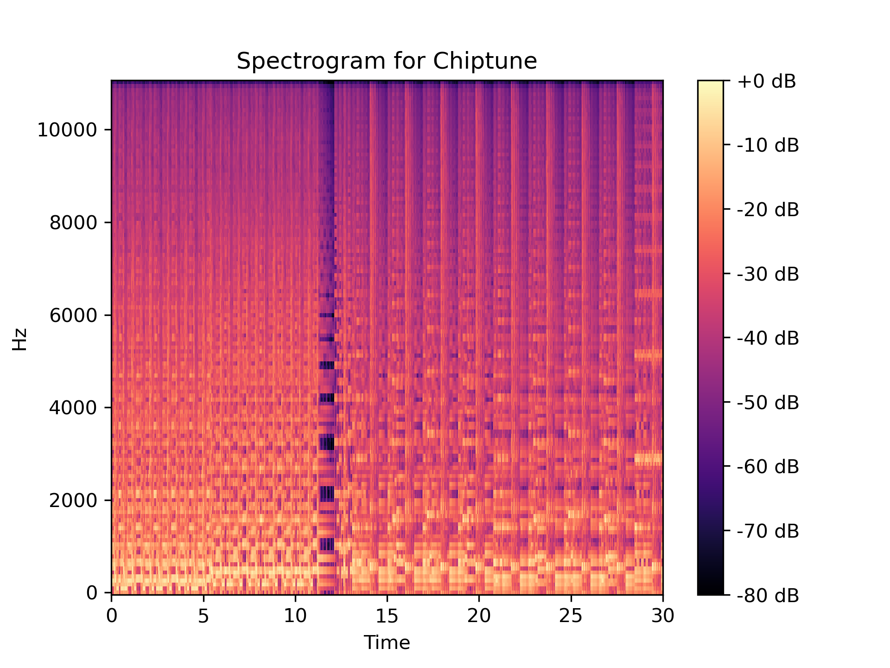

\newpage

## Σχετικά με τον κώδικα

Στην αναφορά αυτήν, σε αρκετά σημεία αναφέρεται το πως
εκτελούνται τα script που γράψαμε για να πάρουμε το ζητούμενο
αποτέλεσμα. Πέρα αυτού στην εργασία μας υπάρχουν και μερικά
README.md αρχεία που περιγράφουν τον σκοπό των διάφορων
scripts και πως αυτά χρησιμοποιούνται.

## Βήμα 1: Εξοικείωση με φασματογραφήματα στην κλίμακα mel 

Επιλέγουμε δύο τυχαία δείγματα με διαφορετικά labels από τα δεδομένα που χρησιμοποιούμε, δηλαδή από ένα υποσύνολο του FMA (Free Music Archive) dataset.

Χρησιμοποιούμε τις συναρτήσεις `read_mel_spectrogram` και `plot_mel_spectrogram` που δίνονται για να απεικονίσουμε τα φασματογραφήματα στην κλίμακα mel των samples αυτών. Η κλίμακα mel που χρησιμοποιείται είναι μη γραμμική, προσαρμοσμένη στον τρόπο που το αυτί του ανθρώπου αντιλαμβάνεται τον ήχο. Παρακάτω παραθέτουμε τα φασματογραφήματα (στην mel κλίμακα) για ένα δείγμα blues και ένα chiptune. 

{width=80%}


{width=80%}

Τα φασματογραφήματα έχουν τον χρόνο (τα χρονικά παράθυρα που χρησιμοποιήθηκαν για τον STFT) στον οριζόντιο άξονα και την συχνότητα στο καταφόρυφο. Παρατηρούμε ότι το δείγμα Blues έχει κυρίως χαμηλές συχνότητες, με μία βασική επαναλαμβανόμενη background μελωδία με αργές μεταβολές συχνοτήτων (βλέπε και σε σχέση με το δείγμα Chiptune), συνοδευόμενο μάλλον από ανθρώπινη φωνή.   

Όσον αφορά το δείγμα Chiptune, παρατηρούμε σχετικά καθαρές γραμμές στο spectrogram (βλέπε και σε σχέση με το δείγμα Blues) που οφείλεται στην απουσία περίπλοκων αρχών νοτών, ήχων από ανάσα, κτλ. Είναι ένα είδος ηλεκτρονικής μουσικής και διακρίνουμε τρεις διαφορετικές μελωδίες στο δείγμα αυτό (0-5, 5-12, 12-30) που αποτελούνται από ένα βασικό μοτίβο (μικρής διάρκειας) που επαναλαμβάνεται συνεχώς. 


## Βήμα 2: Συγχρονισμός φασματογραφημάτων στο ρυθμό της μουσικής (beat-synced spectrograms)

### Ερώτημα α

Τυπώνουμε τις διαστάσεις των φασματογραφημάτων οπότε στην έξοδο του προγράμματος έχουμε:

```{.html}
Spectrogram dimensions : 
(128, 1293)
(128, 1293)
```

Επομένως, το δείγμα της Blues μουσικής έχει 1293 χρονικά βήματα και το δείγμα της Chiptune μουσικής το ίδιο (1293). Ένα LSTM δίκτυο θα αργούσε πολύ να εκπαιδευτεί στα δεδομένα αυτά εξαιτίας του βάθους που θα έχει λόγω του μεγάλου πλήθους timesteps. Αυτό συμβαίνε γιατί
για να υπολογιστεί η έξοδος ενός lstm θα πρέπει να υπολογιστεί
η έξοδος του προηγούμενου (δεν μπορούν να τρέξουν παράλληλα).
Επίσης εμείς θα χρησιμοποιήσουμε ένα lstm για classification χρησιμοποιόντας μόνο την έξοδο του τελευταίου timestep. Αυτό
έχει ως αποτέλεσμα να χρησιμοποιούνται μονάχα οι πληροφορίες από
τα τελευταία timesteps αφού πιθανότατα η πληροφορία από τα
πρώτα timesteps θα έχει ξεχαστεί από το forget gate. Αυτό έχει
επίσης ως αποτέλεσμα οι shared παράμετροι του lstm να εκπαιδεύονται μόνο από τα τελευταία timesteps, αφού το gradient δεν θα φτάσει
στα πρώτα timesteps επειδή το context θα έχει ξεχαστεί σταδιακά
από τις πολλαπλές εφαρμογές του forget gate σε αυτό.

Για να αποφύγουμε αυτά τα προβλήματα που προκύπτουν πρέπει κατά
κάποιο τρόπο να μικρύνουμε το μήκος της ακολουθίας. Για παράδειγμα
θα μπορούσαμε να κάνουμε sample 100 συνεχόμενα timesteps από την
ακολουθεία των 1293 και να χρησιμοποιήσουμε μόνο αυτά για το
classification. Θα μπορούσαμε κιόλας να παίρνουμε πολλαπλά τέτοια
συνεχόμενα δείγματα. Αυτό δεν το δοκιμάσαμε στο βήμα 5 και 6.
Δοκιμάσαμε όμως να χρησιμοποιήσουμε τα beat synced δεδομένα
όπως θα δούμε παρακάτω.

### Ερώτημα β

Στο βήμα αυτό χρησιμοποιούμε τα αντίστοιχα δείγματα (με αυτά που χρησιμοποιήθηκαν στο προηγούμενο ερώτημα) από το dataset με τα beat synced φασματογραφήματα. Παραθέτουμε τα beat synced φασματογραφήματα των δύο δειγμάτων αυτών παρακάτω:

{width=80%}


{width=80%}

Παρατηρούμε ότι σε σχέση με τα αντίστοιχα φασματογραφήματα που είδαμε προηγουμένως, η ευκρίνειά τους έχει μειωθεί μαζί με την χρονική διάρκεια των βημάτων. 
Τυπώνοντας τις διαστάσεις των νέων φασματογραφημάτων αυτών παίρνουμε στην έξοδο του προγράμματος:

```{.html}
Beat-synced Spectrogram dimensions :
(128, 62) (Blues)
(128, 62) (Chiptune)
```

Επομένως, τα νέα φασματογραφήματα έχουν 62 χρονικά βήματα και για τα δύο δείγματα, Blues και Chiptune (το ότι είναι ίδια δεν είναι απαραίτητο, έτυχε στα επιλεγμένα δείγματα). Δηλαδή κρατώντας σημαντικό μέρος της πληροφορίας για το χρονοσυχνοτικό περιεχόμενο του κάθε μουσικού αποσπάσματος, έχουμε μειώσει με το beat-syncing κατά πολύ τα χρονικά βήματα του φασματογραφήματος. 

## Βήμα 3: Εξοικείωση με χρωμογραφήματα

Στο βήμα αυτό χρησιμοποιούμε τις συναρτήσεις `read_chromagram` και `plot_chromagram` που δίνονται για απεικονίσουμε τα χρωμογραφήματα για τα ίδια δείγματα Blues και Chiptune που έχουμε επιλέξει. Παρακάτω φαίνονται τα χρωματογραφήματα και τα beat-synced χρωματογραφήματα για τα δύο αποσπάσματα αυτά. 

{width=80%}


{width=80%}

{width=80%}


{width=80%}

Από τα χρωματογραφήματα παρατηρούμε ότι είναι πιο περίπλοκο όσον αφορά τις νότες που χρησιμοποιεί το απόσπασμα Blues μουσικής σε σχέση με εκείνο της Chiptune. 

Τυπώνοντας τις διαστάσεις των χρωματογραφημάτων (beat-synced και μη) παίρνουμε στην έξοδο του προγράμματος:

```{.html}
Chromagram dimensions :
(12, 1293) (Blues)
(12, 1293) (Chiptune)

Beat-synced Chromagram dimensions :
(12, 62) (Blues)
(12, 62) (Chiptune)
```

Άρα, το πλήθος των χρονικών βημάτων είναι ίδια με εκείνα που είχαμε δει για τα φασματογραφήματα: είναι 1293 για τα αρχικά χρωματογραφήματα και 62 για τα beat-synced. Οι παρατηρήσεις όσον αφορά τα χρωματογραφήματα είναι αντίστοιχες με εκείνες για τα φασματογραφήματα. 

## Βήμα 4: Φόρτωση και ανάλυση δεδομένων

### Ερώτημα α

Στο βήμα αυτό χρησιμοποιούμε τον βοηθητικό κώδικα που βρίσκεται στο αρχείο `train.py` για να κατασκευάσουμε ένα dataset συμβατό με την `pytorch`. Συγκεκριμένα, στο αρχείο `main_train.py` χρησιμοποιούμε την `SpectrogramDataset`. Η κλάση `SpectrogramDataset` φορτώνει τα δείγματα που βρίσκονται στους φακέλους που προσδιορίζουμε. Επιλέγουμε τον φακέλο `fma_genre_spectrograms` του dataset που μας δίνεται ή τον`fma_genre_spectrograms_beat` αν θέλουμε να χρησιμοποιήσουμε τα beat-synced φασματογραφήματα/χρωμογραφήματα. Τα φορτωμένα αρχεία επεξεργάζονται με βάση την συνάρτηση που προσδιορίζουμε για να παράξει τα δείγματα που θέλουμε. Πιο συγκεκριμένα προσδιορίζουμε ως συνάρτηση εισόδου την read_mel_spectrogram αν θέλουμε το dataset να αποτελείται από τα φασματογραφήματα, την read_chromagram από τα χρωμογραφήματα και την read_fused_spectrogram αν θέλουμε για κάθε δείγμα και το φασματογράφημα και το χρωμογράφημά του. 

|  Συνάρτηση που δίνεται ως παράμετρος   | Περιγραφή                    |
| ---:                  |  :---                                         |
| read_mel_spectrogram  | φασματογραφήματα                              |
| read_chromagram       | χρωμογραφήματα                                |
| read_fused_spectrogram| φασματογραφήματα + χρωμογραφήματα             |


Αφού φορτώσει όλα τα δείγματα, εφαρμόζει padding (με μηδενικά) σε καθένα από αυτά ώστε να έχουν όλα τα δείγματα του παραγόμενου dataset το ίδιο μέγεθος (ίσο με εκείνο του μεγαλύτερης διάστασης δεδομένου). Διαβάζει το .txt αρχείο με τα labels που αντιστοιχούν σε κάθε δείγμα και αφού εφαρμόσει το class mapping (προσδιορίζεται ως παράμετρος, το dictionary `CLASS_MAPPING` εδώ) κωδικοποιεί ως αριθμό κάθε label. 

### Ερώτημα β

Το class-mapping που χρησιμοποιούμε διαγράφει κάποια μουσικά είδη με λίγα δείγματα στο dataset και να συγχωνεύει κάποια παρεμφερή μεταξύ τους. Έτσι θα μπορέσουμε να πετύχουμε στην συνέχεια καλύτερα αποτελέσματα στο πρόβλημα ταξινόμησης στις μειωμένες σε πλήθος κλάσεις που επιλέγουμε να κρατήσουμε. Καταλήγουμε σε ένα σύνολο με 10 είδη μουσικής και άρα θα κληθούμε να λύσουμε ένα προβλημα ταξινόμησης 10 κλάσεων. Σημειώνουμε ότι χρησιμοποιούμε το class mapping που μας δίνεται.

### Ερώτημα γ

Υπολογίζουμε τον αριθμό των δειγμάτων κάθε μίας από τις κλάσεις αρχικά και εκείνες που προκύπτουν μετά το class-mapping και απεικονίζουμε το αποτέλεσμα σε μορφή ιστογράμματος. 

{width=80%}

{width=80%}

Παρατηρούμε ότι μετά την επεξεργασία, το dataset που προκύπτει δεν είναι ισορροπιμένο καθώς οι κλάσεις Electronic, Folk, Metal και Rock έχουν η κάθε μία πάνω από τα διπλάσια δείγματα σε σχέση με τις υπόλοιπες. 

## Βήμα 5: Αναγνώριση μουσικού είδους με LSTM.

### Ερώτημα α

Για αυτό το βήμα απλά χρησιμοποιήσαμε το αρχείο lstm.py που μας δινόταν
από το github repo [εδώ](https://github.com/slp-ntua/patrec-labs/tree/main/lab3)
Επίσης χρησιμοποιήσαμε και το `modules.py` που μας δινόταν και συμπληρώσαμε
τα κενά που υπήρχαν στην κλάση `Classifier`.

Σε αυτό το σημείο θεωρούμε πως είναι σημαντικό να περιγράψουμε την δομή
του μοντέλου. Το backbone είναι ένα LSTM το οποίο μπορεί να έχει πολλά επίπεδα,
μπορεί να είναι bidirectional και έχει dropout μεταξύ των επιπέδων (κλάση `LSTMBackbone` στο `lstm.py`). Η έξοδος
του τελευταίου επιπέδου οδηγείται σε ένα fully connected layer αφού περάσει
από ένα dropout layer (κλάση `Classifier` στο `modules.py`). Τελικά οι προβλέψεις
προκύπτουν από την έξοδο του fully connected επιπέδου που αποτελούν τα logits.

### Ερώτημα β

Αφού ετοιμάσαμε τον κώδικα για τα μοντέλα υλοποιήσαμε αρχικά την
συνάρτηση `training_loop` και ύστερα την συνάρτηση `overfit_with_a_couple_of_batches`
που βρίσκεται στο αρχείο `train.py`. Η `train_loop` εκτελεί ουσιαστικά
μία ολόκληρη εποχή εκπαίδευσης διατρέχοντας όλα τα batches του train set.
Για αυτήν την συνάρτηση δεν έχουμε κάτι ιδιαίτερο να σχολιάσουμε πέρα του
ότι πρέπει να προσέξουμε να μεταφέρουμε τα δεδομένα στο device που χρησιμοποιείται
για την εκπαίδευση. Η συνάρτηση `overfit_with_a_couple_of_batches` απλά καλεί
1000 φορές την train_loop χρησιμοποιώντας μόνο 3 batches από το train set.
Ο κώδικας της φαίνεται παρακάτω:

```{.python}
def overfit_with_a_couple_of_batches(model, train_dataloader, optimizer, device):


    # select a couple of batches from the dataloader
    # how many batches to select?
    batches_count = 3  # (select the first batches_count batches)
    train_subset_dataloader = torch.utils.data.DataLoader(
            torch.utils.data.Subset(train_dataloader.dataset, [i for i in range(batches_count)]),
            batch_size = train_dataloader.batch_size
        )
    
    # Run the training loop for an absurd amount of epoch
    epochs = 1000  # An absurd number of epochs
    
    for epoch in range(epochs):
        
        loss = training_loop(model, train_subset_dataloader, optimizer, device)
        
        #print loss every 100 epochs
        if(epoch % 100 == 0):
            print(f"Epoch {epoch: <3}: running loss = {loss:.3f}.")
```

Δοκιμάσαμε να κάνουμε overfit διάφορα μοντέλα με τα όλων των ειδών τα
features για να πλέξουμε αν όντως το loss έφτανε στο μηδέν. Αυτό όντως
συνέβαινε.

Γενικότερα δεν νοιώθουμε πως αξίζει να αναλύσουμε όλο τον υπόλοιπο κώδικα
που χρειάζεται για την εκπαίδευση. Γενικότερα έχουμε ακολουθήσει τον σκελετό
του `train.py` που μας δίνεται. Θα σχολιάσουμε μόνο μερικά πράγματα
τα οποία τα θεωρούμε αξιοσημείωτα.

* Σε περίπτωση που γίνεται κανονική εκπαίδευση (όχι overfitting) καλούμε
  την συνάρτηση `train_normal`. Σε αυτήν υλοποιούμε early stopping με patience 10.
  Δεν πειραματιστήκαμε ιδιαίτερα με την τιμή του patience αλλά επιλέξαμε
  αυτήν την τιμή γιατί δεν φαίνεται η εκπαίδευση να σταματά πρώιμα. Επίσης
  από αυτήν την συνάρτηση αποθηκεύονται checkpoints κάθε 5 εποχές καθώς και
  το βέλτιστο μοντέλο μέχρι στιγμής ως pickle. Επίσης προφανώς για την εκπαίδευση
  χρησιμοποιείται το Cross Entropy Loss.

* Φτιάξαμε ένα δικό μας αρχείο το `main_train` το οποίο περιέχει την συνάρτηση
  `train_helper` η οποία πρακτικά είναι wrapper για την συνάρτηση `train`.
  Η συνάρτηση αυτή είναι βοηθητική γιατί διαχειρίζεται και φορτώνει τα σωστά
  σύνολα δεδομένων απλά αλλάζοντας την παράμετρο `dataset_type` (δες πίνακα παρακάτω). Επίσης σε
  αυτήν την συνάρτηση κατασκευάζεται το μοντέλο, ορίζεται ο optimizer, γίνεται
  η εκπαίδευση και υπολογίζεται το validation accuracy με την χρήση του καλύτερο μοντέλου.
  Το τελευταίο σε συνδυασμό με την ευκολία για τον προσδιορισμό υπερπαραμέτρων
  θα το χρησιμοποιήσουμε αργότερα για να κάνουμε hyperparameter tuning.

* Για να εκπαιδεύσουμε ένα μοντέλο εκτελούμε την
  εντολή `python main_train.py dataset_type epochs [best]`, όπου το
  `dataset_type` προσδιορίζει πιο dataset θα χρησιμοποιηθεί και το epochs
  προσδιορίζει τον μέγιστο αριθμό εποχών που θα χρησιμοποιηθούν (μπορεί
  να σταματήσει νωρίτερα από early stopping). Αν θέλουμε η εκπαίδευση
  να γίνει με την χρήση των καλύτερων υπερπαραμέτρων που βρέθηκαν
  κατά το hyperparameter tuning για το συγκεκριμένο dataset προσθέτουμε
  στο τέλος της εντολής την λέξη `best`. 

| dataset_type          | Περιγραφή                                     |
| ---:                  |  :---                                         |
| spectrogram           | φασματογραφήματα                              |
| chroma                | χρωμογραφήματα                                |
| fused                 | φασματογραφήματα + χρωμογραφήματα             |
| spectrogram_beat      | Beat synced φασματογραφήματα                  |
| chroma_beat           | Beat synced χρωμογραφήματα                    |
| fused_beat            | Beat synced φασματογραφήματα + χρωμογραφήματα |


### Ερώτημα γ

Για όλα τα μοντέλα που εκπαιδεύσαμε κάναμε hyperparameter tuning. Για το
hyperparamter tuning φτιάξαμε το script `hyper_lstm.py`. Σε αυτό το αρχείο
ορίσαμε την συνάρτηση `train_with_random_hyperparameters` η οποία εκπαιδεύει
ένα μοντέλο με τυχαία επιλεγόμενες υπερπαραμέτρους. Τελικά επιλέξαμε να
κάνουμε tune μόνο το learning rate, το dropout και το πλήθος από lstm layers.
Για τις κατανομές που ακολουθούν οι υπερπαράμετροι ισχύουν τα εξής:

1. learning_rate = $10^u$ με u να ακολουθεί ομοιόμορφη κατανομή
2. Το dropout ακολουθεί ομοιόμορφη κατανομή
3. To πλήθος από layers επιλέγεται ως κατά 50% και ως 2 κατά 50%

Παρακάτω φαίνεται ο κώδικας που κάνει sample τις τιμές των υπερπαραμέτρων:

```{.python}
hparams = {
	# any hyperparameter that is not defined here
	# will take its default value when the train_helper
	# method is called

	# All the available hyperparameters
	# lr
	# batch_train
	# rnn_size
	# rnn_layers
	# bidirectional
	# dropout

	"lr": np.power(10, -np.random.uniform(2, 4.4)),
	"dropout": np.random.uniform(0.1, 0.8),
	# "rnn_size": random.choice([32, 64, 128, 256]),
	"rnn_layers": random.choice([1, 2]),
	# "bidirectional": random.choice([False, False, True])

}
```

Επίσης για κάθε μοντέλο που εκπαιδεύεται υπολογίζεται το macro f1 score
του μοντέλου με τις παραμέτρους της εποχής με το μικρότερο validation loss.
Εξηγούμε παρακάτω γιατί χρησιμοποιήσαμε ως μετρική το macro f1 score και όχι
κάποια άλλη μετρική (πχ accuracy).
Επίσης πρέπει να σημειώσουμε ότι η εκπαίδευση των μοντέλων γίνεται κατά
το μέγιστο 50 εποχές.

Παρακάτω φαίνεται ένα γράφημα που περιγράφει το macro f1 score στο validation
set για διάφορες τιμές των υπερπαραμέτρων.

{width=80%}

Από το παραπάνω διάγραμμα παρατηρούμε ότι το f1-score παρουσιάζει την μέγιστη
του τιμή (0.24) για learning rate της τάξης του $10^{-4}$ και για dropout
περίπου 25%. Κανονικά θα έπρεπε να επικεντρωθούμε σε αυτήν την περιοχή
για να βρούμε ακόμη καλύτερες υπερπαραμέτρους αλλά η διαδικασία αυτή
είναι πολύ χρονοβόρα και δεν το κάναμε.


Τελικά εκπαιδεύσαμε ένα μοντέλο χρησιμοποιώντας τις βέλτιστες υπερπαραμέτρους
από αυτές που δοκιμάσαμε χωρίς περιορισμό στο πλήθος των εποχών (θέτουμε
το μέγιστο πλήθος εποχών σε 1000). Εκπαιδεύσαμε δηλαδή ένα μοντέλο χρησιμοποιώντας
τις εξής υπερπαραμέτρους:

```{.html}
lr			7.653515770771733e-05
dropout			0.2360772925986584
batch_train		64
rnn_size		128
rnn_layers		2
bidirectional	False
```

Το `lr` είναι το learning rate, το `rnn_size` είναι το μέγεθος των διανυσμάτων
$h_t$ και $c_t$ των rnn. Τα υπόλοιπα είναι αυτονόητα.

### Ερώτημα δ

Σε αυτό όπως και στα επόμενα ερωτήματα του βήματος αυτού
δουλεύουμε όπως το ερώτημα (γ).

Παρακάτω φαίνεται το διάγραμμα για τις υπερπαραμέτρους. Σε αυτό το ερώτημα
τα δεδομένα εισόδου έχουν πολύ μικρότερη διάσταση, οπότε η διαδικασία
ήταν ταχύτερη και μπορέσαμε να τρέξουμε περισσότερα πειράματα.

{width=80%}

Πάλι παρατηρούμε ότι η καλύτερη επίδοση παρατηρείται για μικρά learning
rate. To dropout δεν φαίνεται να έχει τόση σημασία, αλλά φαίνεται να έχουμε
καλύτερη επίδοση για τις τιμές 15% - 45%.

Τελικά εκπαιδεύσαμε ένα μοντέλο χρησιμοποιώντας τις καλύτερες υπερπαραμέτρους:

```{.html}
lr	9.113253570598068e-05
dropout	0.196015631446461
batch_train	64
rnn_size	128
rnn_layers	2
bidirectional	False
```
### Ερώτημα ε

Παρακάτω φαίνεται το διάγραμμα για τις υπερπαραμέτρους.

{width=80%}

Σε αυτήν την περίπτωση ανεξαρτήτως των τιμών των υπερπαραμέτρων, φαίνεται
να έχουμε σχετικά σταθερή αλλά κακή επίδοση. Στο legend του διαγράμματος
φαίνεται ότι το καλύτερο macro f1 score είναι ίσο με $0.09$.

Τελικά εκπαιδεύσαμε ένα μοντέλο χρησιμοποιώντας τις καλύτερες υπερπαραμέτρους:

```{.html}
lr	0.0041980655608174
dropout	0.1597621752905277
batch_train	64
rnn_size	128
rnn_layers	1
bidirectional	False
```

### Ερώτημα ζ

Παρακάτω φαίνεται το διάγραμμα για τις υπερπαραμέτρους.

{width=80%}

Σε αυτήν την περίπτωση φαίνεται το μοντέλο να επιτυγχάνει το μέγιστο macro f1 score
για μικρές τιμές του learning rate. To dropout δεν φαίνεται να επηρεάζει ιδιαίτερα
την επίδοση.

Τελικά εκπαιδεύσαμε ένα μοντέλο χρησιμοποιώντας τις καλύτερες υπερπαραμέτρους:

```{.html}
lr	0.0001847484837842
dropout	0.5496479144491055
batch_train	64
rnn_size	128
rnn_layers	2
bidirectional	False
```

## Βήμα 6: Αξιολόγηση των μοντέλων


### Περιγραφή μετρικών


**accuracy**

To accuracy υπολογίζεται ως εξής:
$$accuracy = \frac{\text{number of correctly classified samples}}{\text{total number of samples}}$$

To accuracy περιγράφει την ικανότητα του ταξινομητή να κάνει ορθές
προβλέψεις, αφού ισούται με το ποσοστό των δειγμάτων που ταξινόμησε ορθά.


**precision**

Το precision για την κλάση $Α$ υπολογίζεται ως εξής:

$$precision_A = \frac{TP_A}{TP_A+FP_A}$$

όπου

* το $TP_A$ ισούται με το πλήθος των σωστών ταξινομήσεων στην κλάση Α
* και το $FP_A$ ισούται με το πλήθος των φορών που ο ταξινομητής κατηγοριοποίησε
ένα δείγμα μίας άλλης κλάσης στην κλάση $Α$.

Με φυσική γλώσσα το precision για μία κλάση $Α$ ισούται με το ποσοστό
των φορών που ο ταξινομητής πρόβλεψε σωστά την κλάση Α από όλες τις
φορές που προέβλεψε την κλάση Α.


**recall**

Το recall για την κλάση $Α$ υπολογίζεται ως εξής:

$$recall_A = \frac{TP_A}{TP_A+FN_A}$$

με το $FN_A$ να ισούται με το πλήθος των φορών που ο ταξινομητής
ταξινόμησε ένα δείγμα της κλάσης $Α$ σε κάποια άλλη κλάση.

Με φυσική γλώσσα το recall ισούται με το ποσοστό των δειγμάτων
της κλάσης A που ταξινόμησε ορθά.

**f1-score**

Το f1 score για την κλάση $Α$ υπολογίζεται ως εξής:

$$f1_A = \frac{2 \cdot precision_A \cdot recall_A}{precision_A + recall_A}$$

Ουσιαστικά το f1 score ισούται με τον αρμονικό μέσο όρο του precision και
του recall. To f1 score χρησιμοποιείται ως μία μετρική που συνδυάζει
το precision και το recall. Αυτό έχει νόημα γιατί το μεγάλο precision
ή το μεγάλο recall από μόνο του εν αρκεί για να συμπεράνουμε πως ένας
ταξινομητής έχει καλή επίδοση. Αυτό συμβαίνει γιατί οι δύο αυτές μετρικές
παρουσιάζουν ένα trade off μεταξύ τους και γιατί είναι πολύ εύκολο
να επιτύχουμε μικρό precision με μεγάλο recall απλά κατηγοριοποιώντας
όλα τα δείγματα στην κλάση Α, είτε μεγάλο precision ταξινομώντας και
μικρό recall ταξινομώντας μόνο στην κλάση Α τα δείγματα
για τα οποία ο ταξινομητής έχει "πολύ μεγάλη σιγουριά".

**macro-averaged precision, recall και F1-score**

Το macro averaged metric ισούται με τον αριθμητικό μέσο όρο του
metric αυτού αφού υπολογιστεί σε κάθε κλάση. Συνεπώς για παράδειγμα
το macro averaged precision υπολογίζεται ως εξής:

$$(macro averaged precision) = \frac{1}{|C|} \cdot \sum_{c \in C} precision_c$$

όπου το C είναι το σύνολο όλων των κλάσεων του προβλήματος.

Όπως καταλαβαίνουμε τα macro averaged metrics υπολογίζονται θεωρώντας
κάθε κλάση ισότιμη, αφού το κάθε ένα metric σε κάθε κλάση έχει την
ίδια συνεισφορά στο macro averaged metric.

**micro-averaged precision, recall και F1-score**

Για τον υπολογισμό των micro-averaged metrics, θεωρούμε πως όλα τα δείγματα
είναι εξίσου σημαντικά μεταξύ τους. Συνεπώς τα metrics αυτά υπολογίζονται
ως εξής:

$$(micro-averaged precision) = \frac{TP}{TP+FP}$$

$$(micro-averaged recall) = \frac{TP}{TP+FN}$$

$$(micro-averaged f1) = \frac{2 \cdot (micro avg. precision) \cdot (micro avg. recall)}{(micro avg. precision) + (micro avg. recall}$$

Σε αυτήν την περίπτωση αν ο ταξινομητής κατηγοριοποιήσει σωστά ένα δείγμα ανεξαρτήτως
της κλάσης αυτό μετρά ως ένα true positive. Αν το ταξινομητής κατηγοριοποιήσει
ένα δείγμα της κλάσης $Α$ στην κλάση $Β$ τότε αυτό μετράει ως ένα
false positive (από την μεριά του Β) και ως ένα false negative (από την
μεριά του Α). Συνεπώς ισχύει ότι $FP=FN$ και συνεπώς ισχύει το εξής:

$$(micro-averaged precision) = (micro-averaged recall)$$

Μάλιστα επειδή οι αριθμιτές αυτών των μετρικών ισούται με το πλήθος
των σωστών ταξινομήσεων, ενώ ο παρανομαστής ισούται με το πλήθος
των λανθασμένων ταξινομήσεων, οι μετρικές αυτές είναι ίσες με το
accuracy. Επιπλέον αφού το precision είναι ίσο με το recall, και το
f1 score θα είναι ίσο με αυτά. Συνεπώς έχουμε ότι:

$$(micro-averaged precision) = (micro-averaged recall) = (micro-averaged f1) = accuracy$$

Σημειώνουμε ότι η ισότητα αυτή δεν ισχύει σε περίπτωση που κάθε
δείγμα μπορεί να ταξινομηθεί σε πολλαπλές κλάσεις. Εδώ έχουμε
υποθέσει ότι έχουμε πρόβλημα multiclass classification με κάθε
δείγμα να ανήκει σε μία ακριβώς κλάση.

### Απάντηση ερωτημάτων πάνω στις μετρικές


**Τι δείχνει το accuracy / precision / recall / f1 score;**

Αυτά τα ερωτήματα έχουν απαντηθεί παραπάνω.

**Τι δείχνει το micro / macro averaged precision / recall / f1 score;**

Οι μετρικές αυτές σχολιάστηκαν παραπάνω. Θα επαναλάβουμε όμως
μερικά βασικά σημεία. Ουσιαστικά τα micro και τα
macro averaged metrics αποτελούν μετρικές που περιγράφουν την ολική
επίδοση του ταξινομητή ως προς την μετρική που κάνουμε average.

Η μόνη διαφορά μεταξύ των micro και macro averages έγκειται στον τρόπο
με τον οποίο υπολογίζονται αυτά τα averages. Κατά τον υπολογισμό του
macro average έχουν ισάξια επιρροή στο τελικό αποτέλεσμα όλες οι κλάσεις
μεταξύ τους ενώ στο micro average έχουν ισάξια επιρροή όλα τα δείγματα
μεταξύ τους.

**Πότε μπορεί να έχω μεγάλη απόκλιση ανάμεσα στο accuracy / f1 score και τι σημαίνει αυτό;**

Ναι είναι δυνατό, όταν το σύνολο δεδομένων είναι imbalanced. Για παράδειγμα
αν το 1% των δειγμάτων είναι positives και τα υπόλοιπα negatives, ένας
ταξινομητής που προβλέπει πάντα negative έχει 99% accuracy και 0 f1 score (γιατί
το recall είναι μηδενικό).

**Πότε μπορεί να έχω μεγάλη απόκλιση ανάμεσα στο micro/macro f1 score και τι σημαίνει αυτό;**

Αν το dataset είναι balanced τότε τα micro και macro f1 scores βγαίνουν
ίσα. Τα scores αποκλίνουν μονάχα όταν υπάρχει imbalance στα δεδομένα του
test set.

Μάλιστα αν το train set επίσης είχε το ίδιο imbalance με το test set
τότε το micro f1 score θα έχει μεγαλύτερη τιμή από το macro. Αυτό
συμβαίνει γιατί ο ταξινομητής λόγω του imbalance στο train set έχει την τάση
να προβλέπει την κλάση με τις περισσότερα δείγματα του test set και
επειδή στο micro average τα δείγματα είναι ισάξια. Αυτό θα το παρατηρήσουμε
και παρακάτω, στις μετρικές των μοντέλων που εκπαιδεύσαμε.

**Υπάρχουν προβλήματα όπου το precision με ενδιαφέρει περισσότερο από το recall και
αντίστροφα; Είναι ένα καλό accuracy / f1 αρκετό σε αυτές τις περιπτώσεις για να επιλέξω ένα
μοντέλο;**

Υπάρχει προβλήματα που με ενδιαφέρει που με ενδιαφέρει περισσότερο το recall
από ότι το precision. Για παράδειγμα σε έναν συναγερμό δεν θέλουμε να έχουμε
πολλά false negative αλλά δεν πας πειράζει να έχουμε μερικά false positives.
Σε αυτήν την περίπτωση το f1 score δεν αντιπροσωπευτικό για την επίδοση
του ταξινομητή γιατί συνδυάζει ισάξια το precision και το recall. Επίσης
το accuracy δεν θα ήταν μία καλή μετρική γιατί αν υποθέσουμε πως μόνο το
1% των δειγμάτων είναι positive (π.χ. ακούστηκε από αισθητήρα γυαλί να σπάει)
και ο ταξινομητής μας ταξινομεί πάντα σε negative έχουμε accuracy 99% το
οποίο είναι παραπλανητικό.


**Ποια από αυτές τις μετρικές θα επιλέγατε για την αξιολόγηση ενός ταξινομητή σε αυτό το πρόβλημα**

Στην περίπτωση μας τα δεδομένα είναι imbalanced όπως είδαμε και στο ιστόγραμμα
παραπάνω, με μερικές από τις κλάσεις να περιέχουν τον διπλάσιο
αριθμό από δείγματα σε σχέση με τις άλλες. Αυτό το imbalance υπάρχει
και στα δείγματα του test set (φαίνεται παρακάτω από την τιμή του support
για κάθε κλάση).

To imbalance αυτό προκύπτει επειδή συγχωνεύουμε μερικές φορές δύο κλάσεις σε μία.
Για παράδειγμα συγχωνεύουμε την κλάση `Rock` `Psych-Rock` σε μία κλάση
με το όνομα `Rock`. Θα μπορούσαμε να ισορροπήσουμε το dataset με under-sampling
ή με over-sampling, αλλά δεν το κάναμε.

Το accuracy και τα micro averages δεν είναι καλές μετρικές γιατί
το imbalance οδηγεί σε παραπλανητικά μεγάλες τιμές. Αναφέραμε παραπάνω
πως μπορεί ένας ταξινομητής να επιτύχει μεγάλο accuracy προβλέποντας
μόνο την κατηγορία με τον μεγαλύτερο αριθμό δειγμάτων. Επίσης
αναφέραμε ότι τα micro averages δίνουν μεγάλη σημασία στις κλάσεις
με τα περισσότερα δείγματα γιατί όλα τα δείγματα συνυπολογίζονται
εξίσου και όχι οι κλάσεις.

Συνεπώς καταλήγουμε ότι θα χρησιμοποιήσουμε κάποια από τα macro averages.
Όπως αναφέραμε και παραπάνω δεν αρκεί να παρακολουθούμε μονάχα το precision
ή το recall γιατί μπορεί το ένα από αυτά να έχει μεγάλη τιμή ενώ το 
άλλο να έχει πολύ μικρή. Συνεπώς θα χρησιμοποιήσουμε το **macro averaged f1 score**.


### Περιγραφή Κώδικα

Για το evaluation των μοντέλων χρησιμοποιούμε το script `evaluate.py`
και το εκτελούμε ως εξής:

```{.html}
$ python dataset_type path_to_pickle
```

όπου το dataset_type προσδιορίζει το τι είδους είσοδο δέχεται το μοντέλο
υπό εξέταση και το path_to_pickle είναι το μονοπάτι του μοντέλου που
έχει αποθηκευτεί ως pickle.

Όταν εκτελεστεί αυτή η εντολή το μοντέλο φορτώνεται και αξιολογείται
φτιάχνοντας το confusion matrix και υπολογίζοντας όλες τις ζητούμενες
μετρικές. Για τον υπολογισμό των
ζητούμενων μετρικών χρησιμοποιήσαμε την συνάρτηση
`sklearn.metrics.classification_report`.


### Αποτελέσματα για τα διάφορα μοντέλα

Παρακάτω για κάθε μοντέλο παρουσιάζουμε το confusion matrix και
το classification
report από το sklearn χρησιμοποιώντας το κατάλληλο test set.

#### Φασματογραφήματα

{width=80%}

```{.html}
              precision    recall  f1-score   support

       Blues       0.00      0.00      0.00        40
   Classical       0.40      0.47      0.44        40
  Electronic       0.31      0.68      0.42        80
        Folk       0.32      0.57      0.41        80
     Hip-Hop       0.36      0.12      0.19        40
        Jazz       0.00      0.00      0.00        40
       Metal       0.41      0.56      0.47        78
         Pop       0.00      0.00      0.00        40
        Rock       0.36      0.30      0.33       103
    Trip-Hop       0.00      0.00      0.00        34

    accuracy                           0.35       575
   macro avg       0.22      0.27      0.23       575
weighted avg       0.26      0.35      0.28       575
```

<!--

#### Φασματογραφήματα με 1 lstm layer

{width=80%}

```{.html}
              precision    recall  f1-score   support

       Blues       0.00      0.00      0.00        40
   Classical       0.40      0.47      0.44        40
  Electronic       0.31      0.68      0.42        80
        Folk       0.32      0.57      0.41        80
     Hip-Hop       0.36      0.12      0.19        40
        Jazz       0.00      0.00      0.00        40
       Metal       0.41      0.56      0.47        78
         Pop       0.00      0.00      0.00        40
        Rock       0.36      0.30      0.33       103
    Trip-Hop       0.00      0.00      0.00        34

    accuracy                           0.35       575
   macro avg       0.22      0.27      0.23       575
weighted avg       0.26      0.35      0.28       575
```

-->

#### Beat Synced Φασματογραφήματα

{width=80%}

```{.html}
              precision    recall  f1-score   support

       Blues       0.00      0.00      0.00        40
   Classical       0.51      0.50      0.51        40
  Electronic       0.37      0.74      0.49        80
        Folk       0.34      0.74      0.47        80
     Hip-Hop       0.43      0.07      0.13        40
        Jazz       0.05      0.03      0.03        40
       Metal       0.51      0.58      0.54        78
         Pop       0.00      0.00      0.00        40
        Rock       0.41      0.35      0.38       103
    Trip-Hop       0.00      0.00      0.00        34

    accuracy                           0.39       575
   macro avg       0.26      0.30      0.25       575
weighted avg       0.31      0.39      0.32       575
```

#### Χρωμογραφήματα

{width=80%}

```{.html}
              precision    recall  f1-score   support

       Blues       0.00      0.00      0.00        40
   Classical       0.08      0.03      0.04        40
  Electronic       0.10      0.03      0.04        80
        Folk       0.21      0.59      0.31        80
     Hip-Hop       0.00      0.00      0.00        40
        Jazz       0.00      0.00      0.00        40
       Metal       1.00      0.03      0.05        78
         Pop       0.00      0.00      0.00        40
        Rock       0.21      0.64      0.32       103
    Trip-Hop       0.00      0.00      0.00        34

    accuracy                           0.21       575
   macro avg       0.16      0.13      0.08       575
weighted avg       0.22      0.21      0.11       575
```

#### Fused

{width=80%}

```{.html}
              precision    recall  f1-score   support

       Blues       0.00      0.00      0.00        40
   Classical       0.33      0.65      0.44        40
  Electronic       0.32      0.69      0.43        80
        Folk       0.33      0.01      0.02        80
     Hip-Hop       0.00      0.00      0.00        40
        Jazz       0.00      0.00      0.00        40
       Metal       0.67      0.13      0.22        78
         Pop       0.00      0.00      0.00        40
        Rock       0.25      0.75      0.38       103
    Trip-Hop       0.00      0.00      0.00        34

    accuracy                           0.29       575
   macro avg       0.19      0.22      0.15       575
weighted avg       0.25      0.29      0.19       575
```

#### Σχολιασμός αποτελεσμάτων

Παρατηρούμε ότι τα καλύτερα αποτελέσματα macro f1 score έχουμε αν ως dataset ορίσουμε τα beat synced φασματογραφήματα πετυχαίνοντας macro f1 score = 25 % (και 40% accuracy). Το f1 score είναι σχετικά χαμηλό. Αυτό εν μέρη οφείλεται στην μηδενική τιμή του f1 score στις κλάσεις Blues, Pop, Trip-Hop και την σχεδόν μηδενική τιμή του στην Jazz, όπως φαίνεται από το classification report. Χαμηλό είναι και το f1 score για την κλάση Hip-Hop. Στις υπόλοιπες κλάσεις το μοντέλο μας πετυχαίνει f1 score 40-50 %. Παρατηρούμε ότι έχει πολύ καλύτερη επίδοση όπως ήταν αναμενόμενο στις πιο πολυπληθής κλάσεις του dataset (Electronic, Folk, Metal) καθώς και στην Classical (μάλλον επειδή διαφοροποιείται αρκετά από τις υπόλοιπες). 

Από το αντίστοιχο confusion matrix μπορούμε να καταλάβουμε ότι τα περισσότερα λάθη γίνονται πηγάζουν από την τάση του μοντέλου να ταξινομεί στην κλάση Electrinic αρκετά δείγματα άλλων ειδών μουσικής, κυρίως Trip-Hop και Hip-Hop. Αυτό είναι λογικό καθώς πρόκειται είδη που μοιάζουν αρκετά μεταξύ τους (π.χ. χαρακτηρίζονται από σχετικά υψηλό tempo (beats per minute), κτλ) οπότε είναι αναμενόμενο ο ταξινομητής να τις συγχέει. Επίσης, ο ταξινομητής μπερδεύει τις κλάσεις metal και rock μεταξύ τους ταξινομώντας αρκετά δείγματα rock ως metal και το αντίστροφο. Και πάλι η ομοιότητα των δύο ειδών δικαιολογεί τα λάθη αυτά. 

Επιπροσθέτως, παρατηρούμε ότι το μοντέλο έχει κάνει mispredict στην κλάση Electronic αρκετά δείγματα που είναι Classical και Jazz.  Αυτό είναι λογικό αν θυμηθούμε ότι τα δείγματα Electronic στο dataset είναι πάνω από διπλάσια των κλάσεων Classical και Jazz. Γενικότερα, είναι εμφανής η τάση του ταξινομητή να ταξινομεί δείγματα ως Electronic (κατακόρυφη γραμμή στο label Electronic στον confusion matrix). Αντίστοιχη συμπεριφορά έχουμε και για τις υπόλοιπες πολυπληθής κλάσεις, τις Folk, Metal και Rock. Η εξήγηση είναι και πάλι η ανισοκατανομή του dataset : τα δείγματα της κάθεμίας από τις κλάσεις αυτές (Electronic, Folk, Rock και Metal) είναι περισσότερα από διπλάσια από τα δείγματα κάθε μίας εκ των υπολοίπων.

Το μοντέλο που εκπαιδεύτηκε στα chromagrams έχει την χαμηλότερη απόδοση δίνοντας macro f1 score μόλις 8%. Από το classification report μποορύμε να δούμε ότι έχει πολύ χαμηλό (σχεδόν μηδενικό) f1 score σε όλες τις κλάσεις εκτός των Folk και Rock. Παρατηρούμε από τον αντίστοιχο confusion matrix ότι προβλέπει σχεδόν αποκλειστικά τις κλάσεις αυτές, Folk και Rock. Αν σκεφτούμε ότι το χρωμογράφημα είναι ένα φασματογράφημα modulo την οκτάβα, περιέχει λιγότερη πληροφορία από το φασματογράφημα. Έτσι, δυσκολεύεται να διακρίνει μεταξύ παρόμοιων κλάσεων και τείνει να κατηγοριοποιεί δείγματα στις πιο πιο πολυπληθής κλάσεις. 

Η εκπαίδευση με τον συνδυασμό χρωμογραφήματος και φασματογραφήματος για κάθε δείγμα φαίνεται να πετυχαίνει χαμηλότερο macro f1 score σε σχέση με εκείνο που προκύπτει από την εκπαίδευση αποκλειστικά με τα φασματογραφήματα. Αυτό είναι λογικό με βάση την παραπάνω παρατήρηση για την σχέση μεταξύ ενός φασματογραφήματος και του αντίστοιχου χρωμογραφήματος. Η επιπλέον πληροφορία μπερδεύει τον ταξινομητή. Παρατηρούμε ότι από το confusion matrix ότι ταξινομεί δείγματα σχεδόν αποκλειστικά στις κλάσεις Electronic, Rock, Classical. 

## Βήμα 7: 2D CNN.


### Ερώτημα α


Στο βήμα αυτό εκπαιδεύουμε στο MNIST ένα CNN που αποτελείται από δύο επίπεδα.
Το κάθε ένα από αυτά αποτελείται από ένα convolutional layer στην έξοδο του
οποίου εφαρμόζεται μία ReLU και max pooling στην συνέχεια. Δηλαδή, σε κάθε
επίπεδο πραγματοποιείται η συνέλιξη της "εικόνας" εισόδου 8 φορές, με 8
διαφορετικούς πυρήνες. Μπορούμε με διαφορετικά φίλτρα να εντοπίσουμε
διαφορετικά low-level χαρακτηριστικά μίας εικόνας όπως ακμές και γραμμές της
εικόνας. Στο σχήμα \ref{fig:activations} μπορούμε να δούμε το αποτέλεσμα της συνέλιξης της
εικόνας εισόδου με διαφορετικά φίλτρα (πυρήνες). Τα φίλτρα εντοπίζουν αρχέτυπα
(primitive) χαρακτηριστικά της εικόνας όπως γραμμές στην οριζόντια κατεύθυνση
(π.χ. βλέπε 3ο από τα αριστερά feature map), στην κατακόρυφη κατεύθυνση, στην διαγώνιο (π.χ. βλέπε 2ο από τα αριστερά feature
map) που βοηθάνε στην αναπαράσταση του σχήματος του ψηφίου. 

<!--TODO : δεν βλέπω τα επόμενα layers να βρίσκουν άλλα στοιχεία της εικόνα, εβαλα και χωρίς max pooling για να βλέπω καλύτερα και περισσότερα layers
https://medium.com/analytics-vidhya/the-world-through-the-eyes-of-cnn-5a52c034dbeb
-->

{width=80%}

{width=80%}


Το αποτέλεσμα περνάει από την συνάρτηση max(0, input) (ReLU), λειτουργία που
καθιστά τα χαρακτηριστικά που εντοπίστηκαν μέσω της συνέλιξης εντονότερα.

{width=80%}

Στην έξοδο της ReLU, μετά την μείωση της διαστατικότητάς της μέσω max pooling,
εφαρμόζεται ξανά συνέλιξη αυτή την φορά με 16 φίλτρα. Τα αρχέτυπα
χαρακτηριστικά συνδυάζονται για να παράξουν απλά σχήματα. 


Τα επόμενα layers είναι τα αντίστοιχα με προηγουμένως και εξυπηρετούν τον σκοπό
που προαναφέρθηκε το καθένα. 

{width=80%}

Το pooling στο τελευταίο έχει έξοδο ένα flattened vector, το οποίο περνάει από
το fully connected layer και στην συνέχεια από το softmax layer στο τέλος του
μοντέλου. To softmax επίπεδο αντιστοιχεί πιθανότητες σε κάθε μία από τις 10
κλάσεις. Στα activations της εξόδου έχουμε 10 τετραγωνίδια. Όσο πιο λευκό είναι
ένα τετράγωνο τόσο μεγαλύτερη είναι η πιθανότητα που θεωρεί το CNN ότι το
αντίστοιχο ψηφίο πρόκειται για το ψηφίο που απεικονίζει η εικόνα εισόδου. Στην
έξοδο όλα τα activations είναι μηδενικά εκτός από εκείνο που αντιστοιχεί στην
πρόβλεψη του CNN. Για παράδειγμα μπορούμε να δούμε στο παρακάτω σχήμα ότι το
CNN προέβλεψε σωστά ότι το ψηφίο εισόδου είναι το 6.

{width=80%}

### Ερώτημα β 

Στο βήμα αυτό χρησιμοποιήσαμε το αρχείο `convolution.py` που μας δινόταν
από το [github repo](https://github.com/slp-ntua/patrec-labs/tree/main/lab3)


Όσον αφορά την δομή του μοντέλου, το backbone είναι ένα 2D CNN το οποίο έχει 4
επίπεδα (κλάση `CNNBackbone` στο `convolution.py`). Η έξοδος του τελευταίου
επιπέδου οδηγείται σε ένα fully connected layer και τελικά οι προβλέψεις
προκύπτουν από την έξοδο του fully connected επιπέδου που αποτελούν τα logits.

Χρησιμοποιήσαμε την δομή `nn.Sequential` που παρέχεται από την `PyTorch` για να
οργανώσουμε τα layers του νευρωνικού δικτύου. Το κάθε επίπεδο πραγματοποιεί 2D
convolution, Batch normalization, ReLU activation και max pooling. 

Για την λειτουργία 2D convolution χρησιμοποιήσαμε την έτοιμη συνάρτηση της
`PyTorch` `nn.Conv2d`.  Η παράμετρος stride προσδιορίζει πόσο κινείται το
συνελικτικό φίλτρο σε κάθε βήμα. Με μεγαλύτερο βήμα έχουμε μικρότερο overlap
μεταξύ των διαδοχικών features και το feature map που προκύπτει είναι
μικρότερο. Χρησιμοποιώντας padding κρατάμε περισσότερη πληροφορία από τα
περιθώρια της εικόνας εισόδου. Χρησιμοποιήσαμε kernel 5 x 5 (`kernel_size = 5`)
και `padding = 2` για τα δύο πρώτα layers και 3 x 3 (`kernel_size = 3`) και
μοναδιαίο padding (`padding = 1`) για τα δύο τελευταία. 

Προσδιορίσαμε τις παραμέτρους in_channels, out_channels της `nn.Conv` με
δεδομένο ότι το πλήθος των in_channels για ένα layer είναι ίσο με το πλήθος των
out_channels του προηγούμενου layer. Για το πρώτο layer, το in_channels είναι
ίσο με την διάσταση της μονοκάναλης εικόνας εισόδου (του φασματογραφήματος). 


Για την λειτουργία batch normalization χρησιμοποιήσαμε την έτοιμη συνάρτηση της
`PyTorch` `nn.BatchNorm2d`, για την ReLU activation την `nn.ReLU` και max
pooling την `nn.MaxPool2d`. Στην τελευταία χρησιμοποιούμε kernel διάστασης 2 x
2 (`kernel_size=2`) και βήμα 2 (`stride=2`). Στον παρακάτω πίνακα συνοψίζονται
οι τιμές κάποιων βασικών παραμέτρων της δομής του 2D CNN.

| Επίπεδο| input channels | output channels | Convolution Kernel, stride, padding | Max Pooling Κernel, stride |
| :---:  |  :---:         | :---:           |:---:                                |  :---:                     |
| 1      |             1  |         32      |  5 x 5, 1, 2                        |     2 x 2, 2               |
| 2      |             32 |         64      |  5 x 5, 1, 2                        |     2 x 2, 2               |  
| 3      |             64 |         128     |  3 x 3, 1, 1                        |     2 x 2, 2               |   
| 4      |            128 |         256     |  3 x 3, 1, 1                        |     2 x 2, 2               |


### Ερώτημα γ 

Παρακάτω εξηγούμε τον ρόλο των λειτουργιών που εφαρμόστηκαν παραπάνω:

* convolution : Πρόκειται για μία γραμμική λειτουργία που πραγματοποιείται
  μεταξύ της εικόνας εισόδου και ενός πίνακα πραγματικών τιμών που είναι
  γνωστός ως kernel (πυρήνας) ή φίλτρο. Το kernel ολισθαίνει σε κάθε θέση της
  εικόνας και υπολογίζει ένα νέο pixel ως το σταθμισμένο (με τις τιμές του
  kernel) άθροισμα του εκάστοτε μέρους pixels της εικόνας που "βλέπει" όπως
  φαίνεται στο παρακάτω σχήμα (element wise multiplication μεταξύ των δύο
  πινάκων). Ο τελεστής αυτός χρησιμοποιείται για να μεταμορφώσει την πληροφορία
  που είναι κωδικοποιημένη στα pixels. Η έξοδος της λειτουργίας ονομάζεται
  feature map ή activation map. Διαφορετικά φίλτρα παράγουν διαφορετικά feature
  maps για μία εικόνα και μπορούμε να έχουμε λειτουργίες όπως ανίχνευση ακμών,
  καμπυλών, κτλ, sharpening, blurring. Οι τιμές του kernel αλλάζουν σε κάθε
  επανάληψη κατά την εκπαίδευση καθώς το δίκτυο μαθαίνει να εντοπίζει τις
  περιοχές που είναι σημαντικότερες για την εξαγωγή χαρακτηριστικών από τα
  δεδομένα. Πριν την εκπαίδευση επιλέγονται πόσα φίλτρα θα χρησιμοποιηθούν, το
  stride (πλήθος pixels κατά τα οποία ολισθαίνει το φίλτρο) και το
  zero-padding.

{width=80%}

* batch normalization : Η λειτουργία κανονικοποιεί τα δεδομένα σε κάθε layer
  ανά batch ώστε να έχουν μηδενικό μέσο όρο και μοναδιαία απόκλιση. Επιτρέπει
  μεγαλύτερο ρυθμό μάθησης και μειώνει την επιρροή της αρχικής τιμής των βαρών
  στα hidden layers. Επιταχύνει την εκπαίδευση του δικτύου μειώνοντας τις
  απαιτούμενες εποχές και καθιστά την διαδικασία μάθησης ευσταθέστερη. 

{width=80%}

* ReLU (Rectified Linear Unit) : Η ReLU είναι μία element wise λειτουργία που
  εφαρμόζεται σε κάθε pixel του feature map αντικαθιστώντας με μηδέν κάθε
  αρνητική τιμή. Μαθηματικά περιγράφεται ως max(0, x). Το αποτέλεσμα ονομάζεται
  ‘Rectified’ feature map. Σκοπός της λειτουργίας είναι να εισάγει μη
  γραμμικότητα στο δίκτυο. Πρόκειται για την πιο συνήθη συνάρτηση ενεργοποίησης
  για την έξοδο των CNN νευρώνων. Ο υπολογισμός της καθώς και της παραγώγου της
  είναι εύκολος. Επίσης, λόγω της μοναδιαίας τιμής της παραγώγου της στις
  θετικές τιμές βοηθάει στην αποφυγή του vanish gradient προβλήματος. 

{width=80%}

* Max pooling : Η λειτουργία πραγματοποιείται με ένα φίλτρο που ολισθαίνει με
  κάποιο βήμα (stride) πάνω στην εικόνα κρατώντας αντιπροσωπευτικές τιμές από
  την περιοχή της εικόνας που βλέπει σε κάθε του θέση. Οι παράμετροι του max
  pooling kernel προφανώς δεν είναι εκπαιδεύσιμοι. Είναι τεχνική που
  χρησιμοποιείται για την μείωση της διαστατικότητας. Μέσω του down-sampling
  μειώνεται ο υπολογιστικός φόρτος για τα επόμενα layers και γίνεται προσπάθεια
  αποτροπής φαινομένων overfitting. Υπάρχουν και άλλα είδη pooling π.χ. average
  pooling.

{width=80%}

### Ερώτημα δ

Παρατηρούμε ότι θέτοντας `overfit_batch = True` το loss που υπολογίζεται είναι
μηδενικό οπότε το δίκτυο μπορεί να εκπαιδευτεί.

### Ερώτημα ε

Στο βήμα αυτό εκπαιδεύσαμε ένα μοντέλο χρησιμοποιώντας τον Adam optimizer,
Cross-Entropy loss, Early stopping και τις εξής υπερπαραμέτρους:

```{.html}
lr			1e-4
batch_train		64
cnn_filters		[32, 64, 128, 256]
cnn_out_feature_size		1000
```

Το `lr` είναι το learning rate, το `cnn_out_feature_size` είναι η διάσταση
εξόδου του τελικού fully connected layer του 2D CNN και `cnn_filters` οι
διαστάσεις του χώρου εξόδου καθενός από τα 4 layers του δικτύου. 

Για το evaluation του μοντέλου τροποποιούμε το script `evaluate.py` και το
χρησιμοποιούμε ως εξής:

```{.html}
$ python dataset_type path_to_pickle
```

, όπου το dataset_type προσδιορίζει το τι είδους είσοδο δέχεται το μοντέλο υπό
εξέταση και το path_to_pickle είναι το μονοπάτι του μοντέλου που έχει
αποθηκευτεί ως pickle.

Όταν εκτελεστεί αυτή η εντολή το μοντέλο φορτώνεται και αξιολογείται
φτιάχνοντας το confusion matrix και υπολογίζοντας όλες τις ζητούμενες μετρικές.
Για τον υπολογισμό των ζητούμενων μετρικών χρησιμοποιήσαμε την συνάρτηση
`sklearn.metrics.classification_report`.

Παρακάτω για κάθε μοντέλο παρουσιάζουμε το confusion matrix και το classification
report από το sklearn χρησιμοποιώντας το κατάλληλο test set που αφορά τα φασματογραφήματα.


#### Φασματογραφήματα

{width=80%}

```{.html}
              precision    recall  f1-score   support

       Blues       0.23      0.20      0.21        40
   Classical       0.49      0.50      0.49        40
  Electronic       0.47      0.42      0.45        80
        Folk       0.37      0.51      0.43        80
     Hip-Hop       0.43      0.38      0.40        40
        Jazz       0.18      0.17      0.18        40
       Metal       0.51      0.58      0.54        78
         Pop       0.18      0.17      0.18        40
        Rock       0.33      0.29      0.31       103
    Trip-Hop       0.21      0.15      0.17        34

    accuracy                           0.37       575
   macro avg       0.34      0.34      0.34       575
weighted avg       0.36      0.37      0.36       575
``` 

#### Beat Synced Φασματογραφήματα

<!-- TODO: Is this image correct ? -->
{width=80%}

```{.html}
              precision    recall  f1-score   support

       Blues       0.25      0.03      0.05        40
   Classical       0.46      0.75      0.57        40
  Electronic       0.45      0.50      0.48        80
        Folk       0.39      0.65      0.49        80
     Hip-Hop       0.47      0.40      0.43        40
        Jazz       0.27      0.23      0.25        40
       Metal       0.54      0.60      0.57        78
         Pop       0.19      0.12      0.15        40
        Rock       0.42      0.37      0.39       103
    Trip-Hop       0.42      0.15      0.22        34

    accuracy                           0.42       575
   macro avg       0.39      0.38      0.36       575
weighted avg       0.40      0.42      0.39       575
```

Παρατηρούμε ότι τα καλύτερα αποτελέσματα macro f1 score έχουμε αν ως dataset
ορίσουμε τα beat synced φασματογραφήματα πετυχαίνοντας macro f1 score = 36 %
(και 38% accuracy). Το f1 score είναι σχετικά χαμηλό, όπως και στο LSTM μοντέλο
για τους λόγους που προαναφέρθηκαν. Το 2D CNN μοντέλο έχει σημαντικά καλύτερη
επίδοση σε σχέση με το καλύτερο LSTM μοντέλο πετυχαίνοντας κατά 44% μεγαλύτερο macro
f1-score. 

Από τον confusion matrix και από τα επιμέρους f1-scores μπορούμε να δούμε ότι
το CNN μοντέλο δεν "αποδίδει" μόνο στις πιο πολυπληθής κλάσεις, όπως το LSTM.
Συγκριτικά με το LSTM, έχει καλές επιδόσεις σε όλες τις κλάσεις, ακόμα και σε
εκείνες που το LSTM είχε μηδενικές ή σχεδόν μηδενικές τιμές (βλέπε κλάσεις
Blues, Pop, Trip-Hop, Jazz).

## Βήμα 8 : Εκτίμηση συναισθήματος - συμπεριφοράς με παλινδρόμηση.

### Ερώτημα α 

Στο βήμα αυτό χρησιμοποιήσαμε και το `modules.py` που μας δινόταν και
συμπληρώσαμε την κλάση `Regressor` ακολουθώντας την δομή της κλάσης
`Classifier`. Στον `Regressor` απλά αλλάξαμε την συνάρτηση κόστους από Cross
Entropy που ταίριαζε στο classification πρόβλημα σε MSE Loss (`nn.MSELoss`).

### Ερώτημα β-ε

Στο βήμα αυτό εκπαιδεύσαμε μοντέλο Regression. Η εκπαίδευση έγινε στο 80% του
`multitask_dataset` για 30 εποχές ώστε το υπόλοιπο 20% να είναι διαθέσιμο για
την αξιολόγηση του μοντέλου (δεδομένου ότι το test set δεν είναι
επισημειωμένο). Η μετρική αξιολόγησης που χρησιμοποιήθηκε, το μέσο Spearman
correlation (στους άξονες valence, energy και danceability) παίρνει τιμές στο
διάστημα [-1,1] και όσο μεγαλύτερη είναι κατά απόλυτη τιμή τόσο πιο μονοτονική
είναι η σχέση μεταξύ των ground truth και προβλεπόμενων τιμών.

Όσον αφορά την δομή του μοντέλου, ως backbone δοκιμάσαμε το LSTM που βρήκαμε να
έχει την καλύτερη απόδοση (κλάση `LSTMBackbone` στο `lstm.py`) και το 2D CNN
(κλάση `CNNBackbone` στο `convolution.py`). Η έξοδος του τελευταίου επιπέδου
και εδώ οδηγείται σε ένα fully connected layer (κλάση `Regressor` στο
`modules.py`). Τελικά οι προβλέψεις προκύπτουν από την έξοδο του fully
connected επιπέδου που αποτελούν πραγματικούς αριθμούς μεταξύ 0 και 1,
εκτιμήσεις της εκάστοτε επισημείωσης (valence/energy/danceability).


Συνοψίζουμε τις τιμές Spearman Correlation που προκύπτουν για τα ερωτήματα β-ε
στον παρακάτω πίνακα. 

| Emotion    | LSTM Backbone | CNN Backbone | 
| :---:      |  :---:        | :---:        |
| Valence    |        0.135  |   0.491      | 
| Energy     |        0.559  |   0.743      |    
|Danceability|        0.371  |   0.569      |   
| Mean       |        0.355  |   0.6007      |   

Παραθέτουμε τα scatter plots για το regression στα διαγράμματα που ακολουθούν. 

{height=40%}

{height=40%}

{height=40%}

<!-- TODO: Is this image correct ? -->
{height=40%}

{height=40%}

<!-- TODO: Is this image correct ? -->
{height=40%}


Παρατηρούμε ότι το 2D CNN έχει πολύ καλύτερες επιδόσεις. Οι τιμές Spearman
Correlation είναι πιο κοντά στην μονάδα και αυτό συνάδει με τα διαγράμματα όπου
η σχέση μεταξύ ground truth και προβλεπόμενων τιμών για τα συναισθήματα μοιάζει
περισσότερο με γραμμική. Μεγαλύτερο Spearman Correlation πετυχαίνουν και τα δύο
μοντέλα (2D CNN και LSTM Backbone) για την Energy. 

## Βήμα 9 : Μεταφορά γνώσης (Transfer Learning).

### Ερώτημα α 

To δεδομένο άρθρο πραγματεύεται την δυνατότητα μεταφοράς των χαρακτηριστικών κάθε επιπέδου ενός νευρωνικού δικτύου. 
Σύμφωνα με το άρθρο, η δυνατότητα μεταφερσιμότητας κατά βάση εξαρτάται από την επιλογή του επιπέδου όπου "σπάμε" το εκπαιδευμένο νευρωνικό 
και το κατά πόσο προσαρμοσμένα-fitted στο αρχικό task είναι τα χαρακτηριστικά των υψηλότερων επιπέδων. 
Επίσης, το άρθρο υποστηρίζει ότι η αρχικοποίηση των τιμών των βαρών του νέου νευρωνικού με εκείνες του προεκπαιδευμένου αντί για τυχαίες
μπορεί να πετύχει καλύτερα αποτελέσματα όσο και αν διαφέρει το task του προεκπαιδευμένου νευρωνικού από το task που μας ενδιαφέρει. 
Παρατηρήθηκε ότι μπορεί να βελτιώσει την γενικευσιμότητα του νευρωνικού ακόμα και μετά από στοιχειώδες fine-tuning στο νέο task.

<!--TODO : ουσιαστικά το conclusion έχω γραψει του άρθρου, δεν ξέρω αν θέλει κάτι παραπάνω -->
### Ερώτημα β

Για αυτό το βήμα επιλέξαμε να χρησιμοποιήσουμε το CNN μοντέλο
που δέχεται ως είσοδο τα beat synced δεδομένα μιας και αυτό είχε
την καλύτερη επίδοση στο classification task.


### Ερώτημα γ 

Εμείς χρησιμοποιήσαμε το μοντέλο που είχαμε ήδη εκπαίδευση στο Βήμα 7 (ε).
Οπότε δεν εκπαιδεύσαμε κάποιο μοντέλο για αυτό το βήμα. Βέβαια το μοντέλο
το επιλέξαμε γιατί είχε το μέγιστο macro f1 score στο test set από όλα τα μοντέλα
που εκπαιδεύσαμε για το classification problem. Οι λόγους για τους οποίους
επιλέξαμε το macro f1 score ως μετρική έχουν ήδη αναλυθεί στο Βήμα 6.

### Ερώτημα δ


Το αρχικό μοντέλο είχε εκπαιδευτεί για genre classification, οπότε
το προτελευταίο του επίπεδο θα δίνει features τα οποία είναι χρήσιμα
για αυτό το task. Επίσης μεταξύ των valence, energy και danceability
πιστεύουμε πως η καλύτερη επιλογή θα ήταν να εκτιμήσουμε το energy.
Αυτό το ισχυριζόμαστε γιατί το energy είναι κάτι χαρακτηριστικό του
κάθε genre (πχ η rock μουσική περιμένουμε κατά κύριο λόγο να έχει
μεγαλύτερο energy από την jazz) και έτσι περιμένουμε καλή επίδοση δεδομένων
των features από το source μοντέλο. Από την άλλη δεν θα περιμέναμε
τόσο καλή επίδοση αν εκτιμούσαμε το valence γιατί διαφορετικά κομμάτια
εντός ενός genre μπορεί να έχουν διαφορετικές τιμές.

Αρχικοποιούμε λοιπόν ένα μοντέλο με τα βάρη του μοντέλου που επιλέξαμε
και εκπαιδεύουμε το νέο μοντέλο για την εκτίμηση του energy. Από το
source μοντέλο κρατάμε μόνο τις παραμέτρους του backbone ενώ το τελευταίο
fully connected layer είναι randomly initialized. 


Επίσης σημειώνουμε ότι οι υπερπαράμετροι για την εκπαίδευση ήταν οι εξής:

```
lr			1e-4
batch_train		64
```

### Ερώτημα ε

Δοκιμάσαμε να εκπαιδεύσουμε το μοντέλο παγώνοντας το backbone
και λάβαμε αξιοπρεπή αποτελέσματα με Spearman Correlation λίγο μικρότερο
από αυτό του ολικά εξαρχής εκπαιδευμένου μοντέλου. Τα καλύτερα όμως αποτελέσματα
τα λάβαμε όταν κατά την διάρκεια της εκπαίδευσης ενημερώνοντας και οι παράμετροι
του backbone. Τελικά καταλήξαμε σε ένα μοντέλο που πέτυχε **Spearman Correlation
ίσο με 0.749** το οποίο είναι κατά ελάχιστα καλύτερο από αυτό που πετύχαμε
στο βήμα 8 (πετύχαμε 0.743). Επίσης εκπαιδεύσαμε από την αρχή αρκετές φορές
το μοντέλο και καταλήγαμε πάλι σε τιμές του Spearman Correlation γύρω από
αυτήν την περιοχή. Συνεπώς δεν καταφέραμε να βελτιώσουμε σημαντικά την επίδοση
στο task για την εκτίμηση του energy με την χρήση της μεθόδου του transfer learning.

Παρακάτω φαίνεται το διάγραμμα των πραγματικών τιμών έναντι των εκτιμήσεων του μοντέλου μας:


{height=40%}


## Βήμα 10 : Εκπαίδευση σε πολλαπλά προβλήματα (Multitask Learning).

### Ερώτημα α 

Στο paper που μας δίνεται, οι συγγραφείς εκπαιδεύουν ένα μοντέλο σε 8
φαινομενικά ξένα μεταξύ τους task. Στα task αυτά περιλαμβάνεται η μετάφραση
φασικών γλωσσών, το parsing φυσικών γλωσσών, το image classification και
image captioning. Εκπαιδεύοντας αυτό το μοντέλο καταλήξανε στα εξής συμπεράσματα:

1. Το μοντέλο που εκπαιδεύτηκε και στα 8 task έχει περίπου την ίδια και μερικές
   φορές λίγο καλύτερη επίδοση σε σχέση με ένα μοντέλο που εκπαιδεύεται μόνο σε ένα task.
   Μάλιστα στην περίπτωση που το dataset του task είναι περιορισμένο, όπως π.χ. στο parsing,
   το multitask μοντέλο έχει πολύ καλύτερη επίδοση από το αντίστοιχο απλό μοντέλο.

2. Ο συνδυασμός φαινομενικά ξένων task μπορούν να οδηγήσουν σε καλύτερη
   επίδοση. Για παράδειγμα στο paper η εκπαίδευση ενός μοντέλου για parsing
   και για image classification στο ImageNet οδήγησε σε καλύτερη επίδοση στο
   parsing task.

### Ερώτημα β

Για το βήμα αυτό δεν έχουμε κάτι ιδιαίτερο να σχολιάσουμε. Ως loss
απλά επιλέξαμε το άθροισμα των MSE losses των επιμέρους task. Επίσης
δεν χρησιμοποιήσαμε κάποια βάρη. Ενδεικτικά παραθέτουμε τον κώδικα
πο++* mnυ υπολογίζει το loss:


```{.python}
def my_loss_function(targets, logits):
        """
        takes as input logits and targets and calculates the sum of the loss per task 
        (valence, energy and danceability)
        """
        total_loss = 0
        # i = 1 (valence), 2 (energy), 3 (danceability) [in logits table]
	# & 0 (valence), 1 (energy), 2 (danceability) [in targets table]
        for i in range(3):
            total_loss += nn.MSELoss()(targets[:, i], logits[:, i+1])
        return total_loss
```


### Ερώτημα γ 

Για αυτό το ερώτημα επιλέξαμε να εκπαιδεύσουμε ένα μοντέλο με CNN
Backbone το οποίο δέχεται ως είσοδο τα beat synced spectrograms, μιας
και με αυτήν την αρχιτεκτονική πετύχαμε τα καλύτερα αποτελέσματα.
Το μοντέλο εκπαιδεύτηκε με τις εξής παραμέτρους:

```{.html}
lr					1e-4
batch size				64
cnn_filters				[32, 64, 128, 256]
cnn_out_feature_size	1000
```

Το `lr` είναι το learning rate, το `cnn_out_feature_size` είναι η διάσταση
εξόδου του τελικού fully connected layer του 2D CNN και `cnn_filters` οι
διαστάσεις του χώρου εξόδου καθενός από τα 4 layers του δικτύου. 

Επίσης όπως και στα υπόλοιπα ερωτήματα το μοντέλο εκπαιδεύεται με early
stopping και το evaluation γίνεται στο μοντέλο με τις καλύτερες παραμέτρους.

### Ερώτημα δ

Παρακάτω φαίνεται το Spearman Correlation για το multitask μοντέλο για κάθε
task αλλά και για τα CNN μοντέλα του βήματος 8 για λόγους σύγκρισης:

| Emotion    | Multitask Regressor with CNN Backbone |  CNN Backbone / Single task models    | 
| :---:      |  :---:                                |      :---:                            |
| Valence    |       0.519                           |     0.491                             | 
| Energy     |       0.754                           |     0.743                             |    
|Danceability|       0.543                           |     0.569                             |   
| Mean       |      0.6054                           |     0.6007                            |   


Από τον παραπάνω πίνακα παρατηρούμε ότι η επίδοση του Multitask μοντέλου είναι καλύτερη σε κάθε
task με εξαίρεση του Danceability. Αναθέτοντας πολλά task ωθούμε ένα μοντέλο στο να βρει features
τα οποία ωφελούν και όλα τα task ταυτόχρονα. Συνεπώς το μοντέλο καταλήγει να εξάγει πιο
ουσιαστικά features που δεν περιγράφουν τον θόρυβο του train set, οδηγώντας σε καλύτερο generalization.
Αυτός είναι και ο λόγος που το Multitask μοντέλο έχει καλύτερη επίδοση για την εκτίμηση του valence και 
του energy.

Τέλος παρακάτω φαίνονται τα διαγράμματα των πραγματικών τιμών έναντι των εκτιμήσεων του μοντέλου μας:

{height=40%}

{height=40%}

{height=40%}

